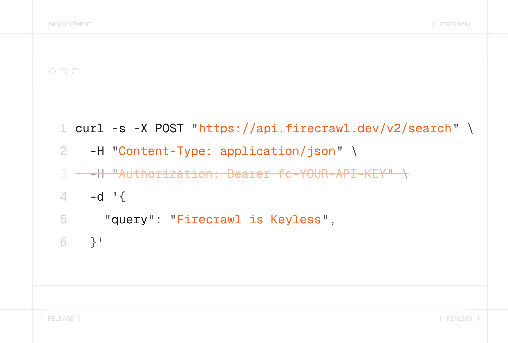

设置一个网页数据 API 通常从填写注册表单开始。创建账户、生成密钥、将其粘贴到环境变量文件中、编写第一行代码。在构建任何东西之前，这已经是重重阻碍。

**今天我们正式推出 Firecrawl Keyless。无需 API 密钥即可搜索、抓取并与网页交互。** 每位开发者每月自动获得 1,000 个免费积分。只有当您需要更多时，才需要注册。

借助 Firecrawl Keyless，您可以：

-   **搜索** 网页，获取包含完整页面内容的实时结果
-   **抓取** 任意 URL，获取干净的 Markdown 格式内容，包括 JavaScript 密集型页面
-   **交互** 操作页面，实现点击、填写表单、分页以及动态网站的导航

现已同步上线于我们的 MCP、CLI 和 API。

对于编码代理而言，这一点更为重要。连接 Claude Code、Cursor、OpenClaw、Hermes Agent、OpenCode 或任何其他兼容 MCP 的主机，代理即可立即开始抓取和搜索。无需人工介入来生成密钥并粘贴到配置中。

```
# Add Firecrawl MCP to Claude Code - no key needed
claude mcp add --transport http firecrawl https://mcp.firecrawl.dev/v2/mcp
```

API 密钥总在最糟糕的时刻失效：黑客松演示、工作坊、几个月后重新拾起的副业项目。Keyless 消除了这类失败场景，适用于每月 1,000 个积分完全够用的项目。

Firecrawl Keyless 已全面上线：

-   **MCP** - 将任何兼容 MCP 的客户端指向 `https://mcp.firecrawl.dev/v2/mcp`
-   **CLI** - 运行 `npx firecrawl-cli@latest` 即可开始抓取
-   **API** - 直接调用 Firecrawl REST 端点，无需 `Authorization` 请求头

您每月可获得 1,000 个免费积分，每月都有。当用量超出限制时，注册并携带您自己的密钥即可。

[开始使用 Firecrawl Keyless](https://www.firecrawl.dev/) · [阅读文档](https://docs.firecrawl.dev/)
