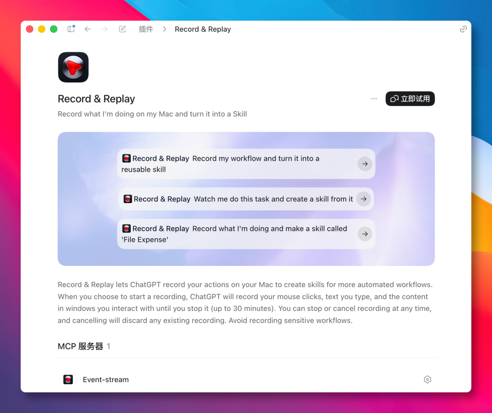
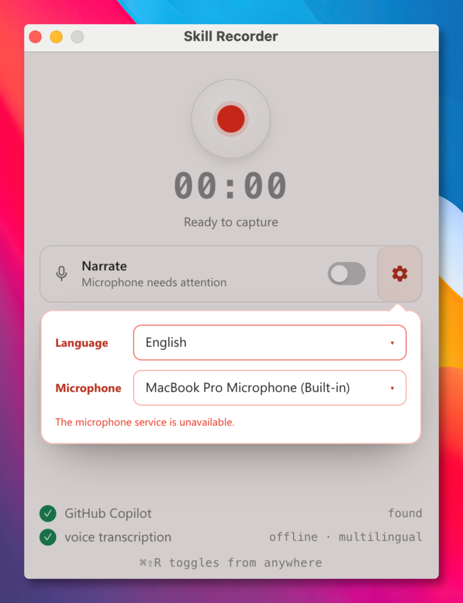
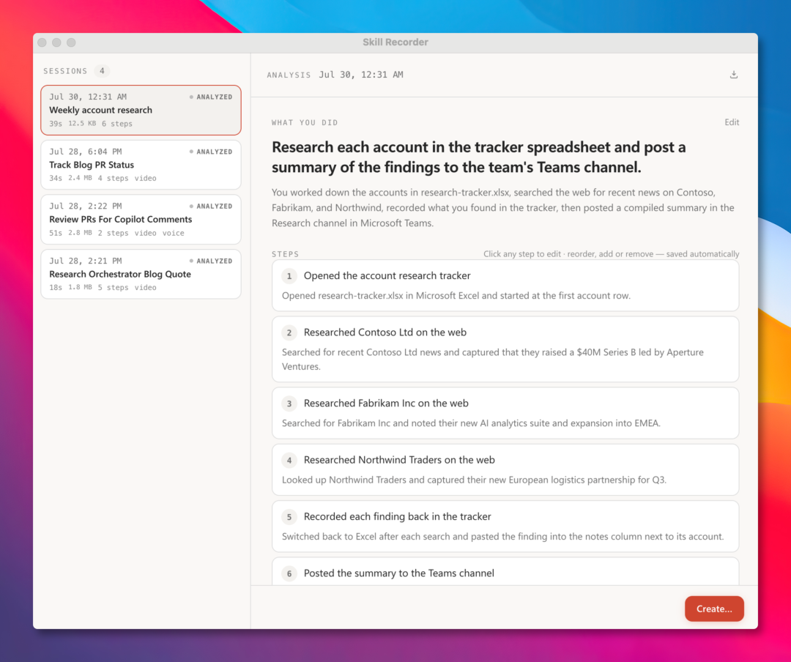
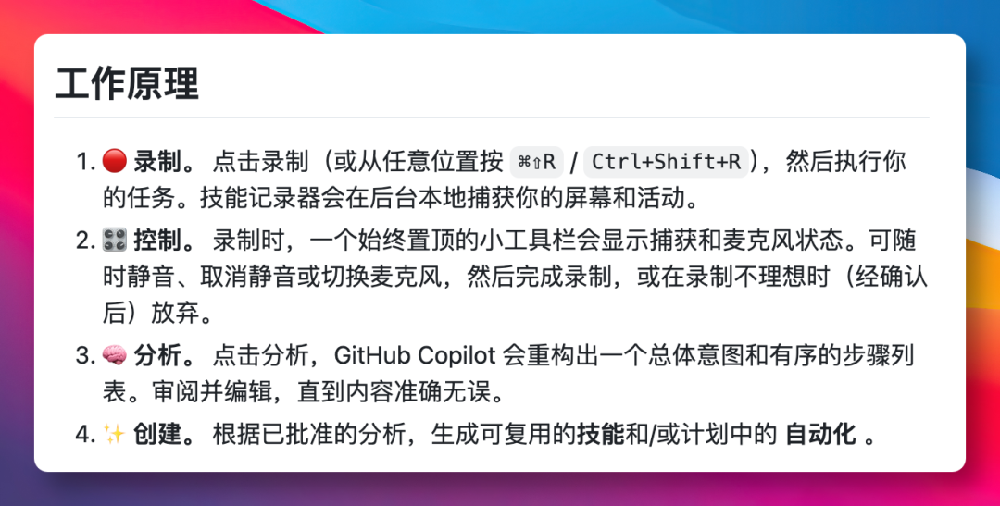
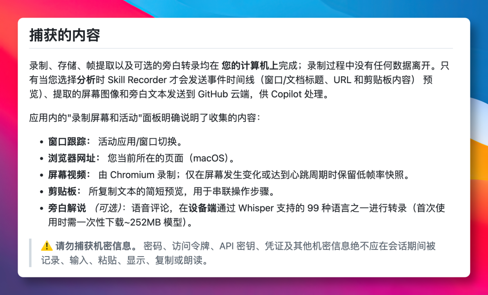

想让 Claude Code 或 Codex 替我们干重复性的活，眼下比较好的做法是写一个 Skill。

把任务目标、执行步骤、注意事项等等所有细节写清楚，相当于给 AI 写一份操作手册。

但写 Skill 这事情，本身挺折磨人的，需要先总结自己工作流程，后续还得不断打磨优化。

为了降低这个门槛，两个月前，Codex 便上线了一个「Record & Replay」插件。



通过录屏的方式，我们只要任务做一遍，完成后之后自动生成一份可复用的 Skill。

后来 Anthropic 也跟上，在 Claude Cowork 里加入了类似的功能「Record a skill」。

可以说，用录屏方式教 AI 学会技能已成了共识，不过这两家的功能都在自家的工具里。  

直到最近，微软把这思路封装成一个桌面工具 **Skill Recorder**，并直接开源了。



同样也是通过录屏方式制作 Skill，点击录制按钮便开始，在电脑上完成我们重复性的任务。

在录制过程中，还可以开启麦克风，一边录制一边口述自己为什么这么操作。

当录完之后，再点击「分析」按钮，就会交给 AI 分析，整理成「一个意图」和「一组有顺序的步骤」。

这里我们进行检查，若有哪一步的流程描述不对可以动手修改，改到满意为止。

在确认没问题后，一键生成可复用的 Skill，或者按时间和触发器定时执行的 Automation。

下次再干同类活，可以把生成的 Skill 直接丢给 Agent 执行。

而 Automation 则多了定时或事件触发，适合把日报整理、表单提交这类活挂起来自动跑。



看到这里，其实大家有没有感觉，这个流程有点像传统 RPA 那套自动化流程。

但实际它们区别挺大的。RPA 记的是鼠标点哪里、按钮在哪个位置，界面一改工作流就废。

而 Skill Recorder 是先理解我们想完成什么，再把操作换成 gh CLI、web\_fetch 这类 Agent 原生工具。

比如录一次提交表单，便教会 Agent 提交所有同类的表单，从单个操作泛化成一类能力。

我觉得这种泛化才是它真正有意思的地方。



对于录屏工具，最容易让人担心的还是隐私问题，微软在 README 上写得很明白。

所有的操作全在本地完成，包括录制、存储、画面提取、还有语音转写。

只有点击「分析」按钮，事件时间线、屏幕截图和旁白文本才会发给云端 AI 进行处理。

其中语音转写，用的是 Whisper 模型在本地语音转文字，支持 99 种语言。

但还是得提醒一下，在录制的时候，避免出现密码和 API Key 这些敏感的信息。



安装方式，只需要一条命令即可，可以从项目的 Release 发布页面获取。

```
commit="<40-character-release-commit>"; curl -fsSL "https://raw.githubusercontent.com/microsoft/skill-recorder/$commit/install.sh" | SKILL_RECORDER_COMMIT="$commit" bash
```

目前主要支持 macOS 系统，Windows 11 和 Linux 系统也有对应安装方式。

首次使用需要授予录屏权限，分析功能则需要带 Copilot 权限的 GitHub 账号。

目前项目刚开源不久，还存在不少问题，但也留意到微软技术团队正快速迭代更新。

如果大家在使用过程遇到什么问题，也可以在项目 issue 上进行反馈。

### 写在最后

这两个月，几大 AI 科技巨头都在纷纷跟进同一功能，就是如何教会 Agent 干活。

说明了一点，现在的模型已然足够强大，但要让它成为我们日常工作生活的干活利器，还得靠 Skill 沉淀。

但写 SKILL.md 文件，需要较强的表达能力，而通过录制演示的方式，门槛则降低许多。

就像一位新入职的同事，跟他说再多，都不如直接上手给他演示一遍工作流程来得高效。

如今微软选择用 MIT 协议把 Skill Recorder 开源，也算是更进一步推动这个方向的发展。

相信不久，将会有越来越多的 Agent 工具会跟进这一功能，让大家更容易用 AI 干活。

GitHub 项目地址：https://github.com/microsoft/skill-recorder

今天的分享到此结束，感谢大家抽空阅读，我们下期再见，Respect！
