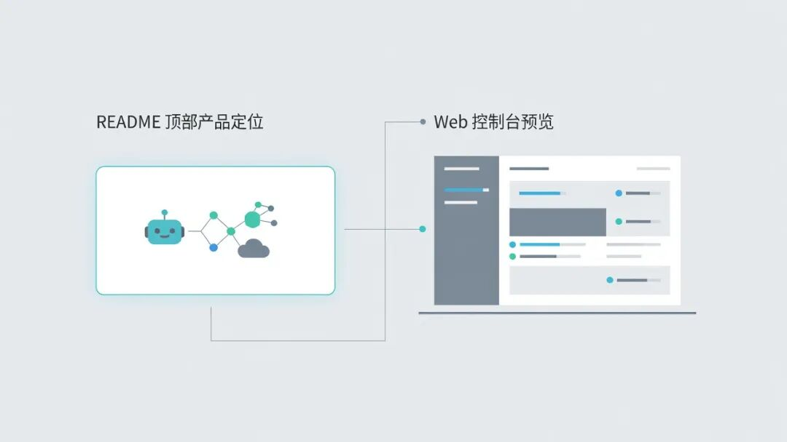
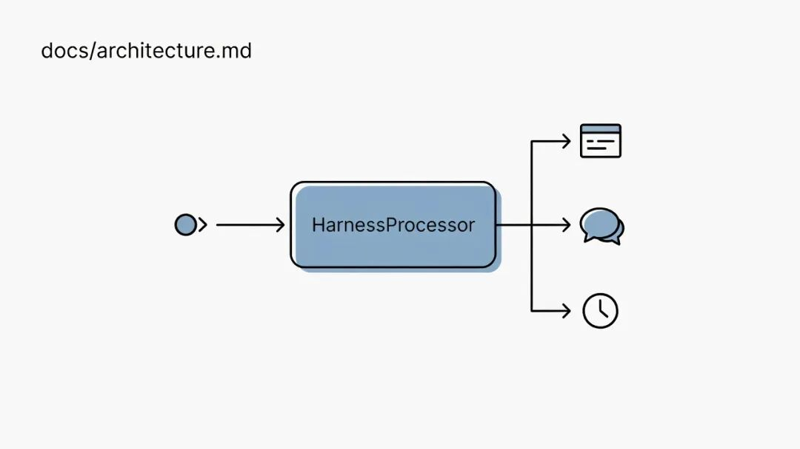
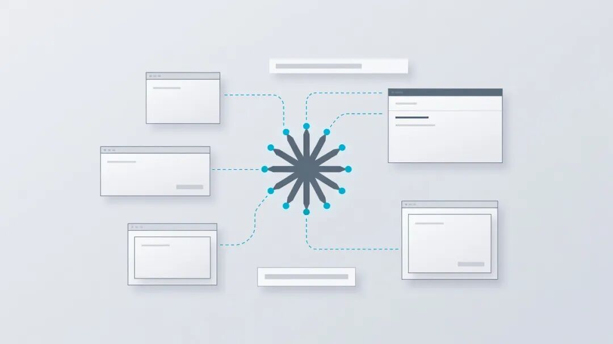

腾讯云开源了一款野心十足的 AI 助手项目 Octop。它远不止是聊天机器人，而是一套可在个人电脑本地部署的“多智能体 AI 工作站”。

家用 AI 助手我装过好几个，最后都败在同一件事上：只能我一个人聊。家里那位想用，得重新配一遍 API Key；同事想远程用，得开公网端口，模型账单还混在一起。**Octop** 是我最近遇到的第一个觉得这事儿能解的项目：一条进程里跑多用户、多 Agent，本地数据默认落在 `~/.octop/`，还能把飞书、钉钉、QQ、企业微信、Discord 都接成入口。

## 一句话介绍

腾讯云团队（仓库挂在 TencentCloud 组织下）以 MIT 协议开源的自托管 AI 助手平台，前身是 **LightClaw ACE**。按官方说法，本次是系统性重构，不是换皮。2026 年 7 月底开源，截至 2026-08-06 仓库 Star 约 760、Fork 约 104，最新版本 `v0.9.19`（PyPI 同号，2026-08-05 发布）。

## 它能干什么

### 多用户与多 Agent

内置 JWT 多用户隔离，不是“一个 Key 全家用”的单点登录。每个成员可以挂自己的若干 Agent，配置自己的模型凭据和工作区；家里各管各的提示词，同事上来也看不到你的聊天记录。

### 多种入口

单进程同时给 Web 控制台、CLI、IM（飞书、钉钉、QQ、企业微信、Discord）和定时任务做路由。你可以在公司飞书里把任务交给家里电脑上的 Octop，回家开浏览器继续查看结果。

### 能够执行任务

除了对话壳，还内置浏览器（Playwright）、终端和远程桌面。官方把它描述为 **ACP**：既能被 OpenCode、Claude Code、Codex、CodeBuddy 这类 IDE Agent 反向调用，也能派活给它们。简单说，你让 Octop 派一个任务，它能让 Claude Code 去改代码，同时自己开浏览器做验证。

### 记忆与工作区留在本机

默认使用 SQLite（WAL），数据落在 `~/.octop/octop.db`，也可以换 PostgreSQL。官方反复强调对话、工作区和凭据尽量留在自有机器上，这也是它和云端企业 Agent 平台最大的区别。

### 其他能力

- MBTI 人格模板
- 腾讯系 Connector（文档、微博热搜、新闻等）
- 工具审批与 Shell 命令防护
- PII 脱敏
- Linux 侧的 bubblewrap 执行沙箱（`0.9.19` changelog）

## 为什么值得花时间

跟 **OpenClaw**（社区里常叫“龙虾”或 Clawdbot）那类自托管个人助手比，Octop 更突出“多人共用一台实例”与“每用户多 Agent / 专家库”，内置远程桌面和 ACP 双向通道。

跟纯聊天 UI（Open WebUI 那一类）或多 Agent 开发框架（LangGraph、Crew 等）比，它不是只做对话壳，也不是只给开发者 SDK，而是把控制面、网关、记忆、仪表盘打包成单进程可交付产品。

跟云端企业 Agent 平台（比如腾讯云 ADP）比，它是 MIT 开源、自托管，数据归自己。

我的真实推荐理由不是它功能最多，而是它把“一个家或一个小团队怎么共用一台机器跑 AI 助手”当成一等公民来设计，而不是藏在高级设置里。

## 怎么上手

门槛不算高，主要有三种方式：

- **一键脚本**：macOS / Linux 使用官方 curl 脚本，Windows 提供 PowerShell 和 cmd 版本，安装源托管在腾讯云 COS。
- **pip**：`pip install octop`，要求 Python 3.12+。
- **Docker Compose**：直接拉起整套服务。

默认监听 `http://127.0.0.1:8088`，默认账号是 `admin`，密码是 `octop`。README 明确要求立刻修改默认密码；Docker 可以通过 `OCTOP_DEFAULT_PASSWORD` 等环境变量设置。

模型侧支持 OpenAI 兼容 API、DashScope（Qwen 系）、Ollama 等预设，自己填 Key 即可，本体不绑定任何模型推理费用。

飞书、钉钉、QQ、Discord、企业微信接入需要各自平台申请凭据，第一次配置会多花点时间，但 README 把步骤拆得比较细。

## 适合谁，先说几个坑

### 适合

有一台常年开机的小服务器或 NAS，想给全家或小团队搭一个长期共用的本地 AI 助手的开发者；想拿多 Agent 能力做家庭自动化、新闻聚合、跨设备任务调度的人；以及想研究“把控制面、网关、记忆打成单进程”的人。

### 不太适合

需要横向扩展、扛高并发多租户的企业用户；以及特别在意每一个依赖都必须可审计、可二次开发的朋友。

### 老实交代的局限

版本还在 0.9.x，没到 1.0。Agent 运行时的核心依赖 `orcakit-harness-agent`、`harness-gateway`、`harness-memory`、`harness-browser` 等以 PyPI 包形式交付，但截至发稿，`TencentCloud/harness-agent` 等源码仓库在 GitHub 上 API 返回 404。能装能跑，但想深度二次开发或做供应链审计的朋友，得先想清楚这层边界。

默认弱口令叠加远程桌面、Shell 和浏览器自动化，公网暴露前一定要改密并配好防护。路线图里的资源共享池、专家共享、浏览器录制为技能、AgentTeams 自主编排、对话自进化沉淀技能、原生 PC / 移动客户端都还排在后面，README 自己写明了“未完成”。

## 总结

Octop 不是一个让你“明天就用上”的项目，但它把一个真问题认真地做成了一份能跑的开源产品：怎么让一台机器、一个家或一个小团队长期共用一个能动手、能记住事、能把活派出去的 AI 助手。

如果你正好被这个问题困扰过，值得花个下午把它装起来跑跑。

仓库地址：[TencentCloud/Octop](https://github.com/TencentCloud/Octop)

给小编顺手点个赞，也可以转给那个总在你家或办公室里借你 API Key 用的同事。
