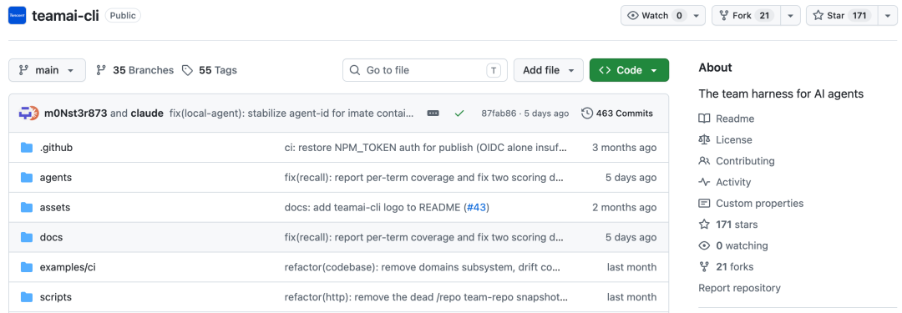

**teamai-cli** 是腾讯开源的一款 **Git驱动的团队AI协作基础设施**。

简单说，它把团队里所有AI编程工具（Claude Code、Codex、Cursor、CodeBuddy、WorkBuddy、Gemini CLI、Windsurf、Trae、Aider……20多款）的Skill、Rule、Doc、Hook、MCP Server配置等资源，统一放进一个Git仓库里，用最原生的方式分发到每个人的本地AI中。

如果说以前每个开发者的AI配置是"各自为政的方言"，那 teamai-cli 就是给整个团队定义了一套"普通话"——大家用的AI工具可以不一样，但遵循的规范、拥有的技能、参考的文档，完全一致。

它相当于把公司的**员工手册+培训体系+知识库管理系统**，直接塞进了每个开发者的AI编程工具里。

而且是Git原生的，push、review、merge、pull，这套流程开发者用了十几年，零学习成本。

### 四大核心亮点

#### 跨工具统一：20+ AI编程工具一套配置全同步

支持的工具列表长到吓人：Claude Code、Codex、Cursor、CodeBuddy IDE、WorkBuddy、Gemini CLI、Windsurf、Trae、Aider、Amp、OpenClaw……

只要是市面上主流的AI编程工具，teamai-cli 基本都覆盖了。

以前你在Claude里配好一套Skill，换Cursor就得重来一遍，换Codex又得重来。

现在不用了——把Skill放进TeamAI的共享仓库，一次配置，所有工具自动同步。

Claude的`~/.claude/skills/`、Cursor的`~/.cursor/skills/`、Codex的对应目录……teamai pull一跑，全部到位。

#### Git原生分发：开发者零学习成本，流程复用现有体系

TeamAI没有发明什么新奇的协作协议，也不搞什么中心化服务器。它的分发机制简单粗暴但极其有效：

`teamai push → 自动创建分支 + 发起MR → 审核人审批 + 合并                                                   ↓                    SessionStart Hook → teamai pull → 同步到本地所有AI工具`

对，就是你天天用的Git工作流。

管理员在GitHub或TGit上建一个仓库，成员`teamai init <仓库地址>`一键接入。

想改规则？`teamai push`提交MR，审完合并，全队下一次开AI会话时自动生效。

没有学习曲线，没有洗脑培训，甚至不用通知大家——AI开个新会话，SessionStart Hook自动执行`teamai pull`，悄咪咪就同步好了。

#### 四层能力矩阵：不止是同步配置，更是团队知识基础设施

teamai-cli本质上不只是个同步工具，它围绕AI的Harness层，构建了一整套四层能力体系：

**第一层：Harness管理与分发**——Skills、Rules、Docs、Hooks、Env、MCP配置，全量Git管理，一键分发。

**第二层：跨团队技能订阅**——通过`teamai source add`，可以订阅其他团队公开的技能仓库。安全团队出一套代码审计Skill，前端团队写一套组件规范Skill，各取所需，订阅即同步，形成团队间的"经验联邦"。

**第三层：经验驱动的知识库**——这是最有意思的一层。TeamAI内置了一套"摩擦信号"机制，每次会话结束时，Stop Hook会自动打分：你有没有打断过AI？有没有拒绝过它的工具调用？AI有没有反复重试失败的命令？

又长又顺的会话不会触发，但只要你"和AI搏斗过"，系统就会识别出这次会话里藏着值得记录的问题，主动提醒你：

`[teamai] 本次会话可能包含值得记录的问题：你打断了AI 2次，   AI重试失败的工具 8 次。   任务：修复重复的项目级Hook注入问题      建议运行 /teamai-share-learnings 总结本次经验并分享给团队。`

个人踩坑的血泪史，就这样自动变成了团队的公共财产。

**第四层：知识召回与复用**——沉淀了经验还不够，能在对的时间想起来才是关键。TeamAI提供了基于BM25+图谱增强排序的召回子智能体，任务开始前自动检索团队知识库，还会先做一次相关性预检，与团队知识无关的任务直接跳过，不瞎打扰。

更狠的是`teamai import`，它能把代码仓库解析成结构化的知识图谱——组件、接口、配置、跨仓库依赖关系全部抽取出来。AI检索时直接带着"地图"去改代码，不用再像盲人摸象一样从头探索整个仓库。

#### 角色与权限：DevOps和PM用不同的Skill包，互不干扰

不是所有人都需要同样的技能。后端开发需要部署和数据库调优的Skill，前端需要组件和构建的Skill，PM可能只需要项目文档和需求管理的Skill。

TeamAI通过`manifest/roles.yaml`实现了基于角色的技能隔离。

管理员定义好角色（hai、pm、devops……），每个角色绑定不同的命名空间，成员`teamai roles set hai`选好自己的角色后，pull只会同步对应命名空间下的技能，干净利落。

甚至还支持主角色+附加角色的组合：`teamai roles set hai --add pm`，主用后端技能，顺便也能看到PM的规范文档。

### 快速上手

#### 第一步：安装

`# 需要 Node.js ≥ 18   npm install -g teamai-cli      # 验证安装   teamai --version`

#### 第二步：管理员初始化（只需做一次）

在GitHub/TGit/CNB上建一个空仓库，建议命名为`TeamAi-<团队名>`，给成员开写权限。然后：

`# 项目级（默认，资源装在项目目录下）   cd /path/to/my-project   teamai init <你的组织>/TeamAi-<团队名>      # 或者用户级（资源装在~/下，跨项目通用）   teamai init <你的组织>/TeamAi-<团队名> --scope user`

个人开发者甚至不用先建仓——`teamai init`检测到仓库不存在时，会自动帮你创建。

#### 第三步：团队成员接入

`npm install -g teamai-cli      # 成员在自己的项目目录里执行   cd /path/to/my-project   teamai init https://github.com/你的组织/TeamAi-你的团队`

完了。从此每次打开AI会话，自动同步最新资源。

#### 第四步：日常使用

**分享资源到团队：**

`# 本地写好Skill/Rule/Doc后   teamai push          # 检测变更，创建MR等待审核   teamai push --all    # 跳过确认，直接推送`

**手动同步（一般不需要，自动的）：**

`teamai pull              # 拉取最新   teamai pull --dry-run    # 预览一下，不实际改`

**查看状态：**

`teamai status     # 当前作用域、最后同步时间、资源数量   teamai list       # 所有Skills/Rules/Docs/Env/Agents/Hooks/MCP   teamai members    # 看队友们都有谁   teamai skill show <技能名>  # 看某个技能的详情`

**不想用某个团队共享的Skill？本地排除，不影响别人：**

`teamai skill exclude add using-superpowers   teamai pull   # 本地就不装这个了      # 想用回来   teamai skill exclude remove using-superpowers   teamai pull`

#### 进阶玩法

**跨团队订阅别人的技能：**

`teamai source add https://github.com/other-team/teamai-public.git --name other-team   teamai source browse other-team   # 看看他们有啥好东西`

**把代码库导入成知识图谱：**

`teamai import --from-repo https://github.com/org/repo   teamai recall "GPU内存溢出"  # 搜搜团队有没有人踩过这个坑`

**一键开启知识召回：**

`teamai recall enable    # AI做事前会先搜一下团队知识库`

**看团队AI使用数据面板：**

`teamai dashboard --port 8080`

### 写在最后

最近两年 AI 编程工具的迭代快到令人眼花缭乱，模型换了一茬又一茬，工具出了一个又一个。

但很少有人关注一个最朴素的问题：**我们给AI花了那么多时间调教的那套东西，能不能带走？能不能复用？能不能共享？**

teamai-cli 给出的答案非常务实：就用你们已经用了十几年的Git，把技能、规则、经验全部装进去，按已经跑通的协作流程流转。

没有颠覆式创新，但每一步都踩在开发者最熟悉的节奏上。

这大概就是腾讯做基础设施的风格吧——不搞花里胡哨的概念，扎扎实实把团队协作里最痛的那些"小事"给解决了。

**GitHub：** https://github.com/Tencent/teamai-cli

  

  

  

  

  

  

如果本文对您有帮助，也请帮忙点个 赞👍 + 在看 哈！❤️

**在看你就赞赞我！**

