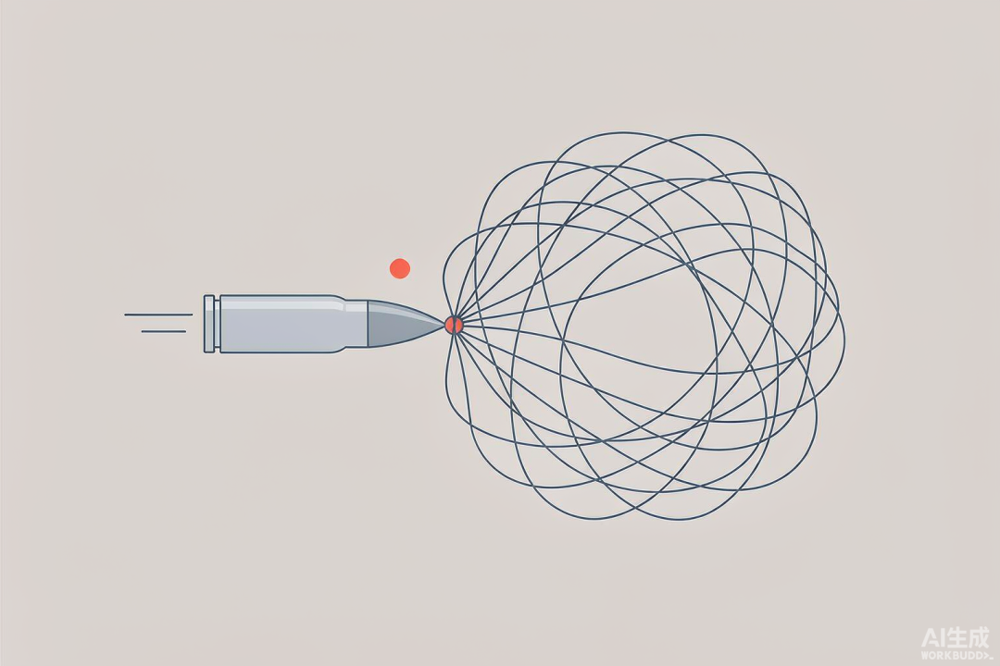
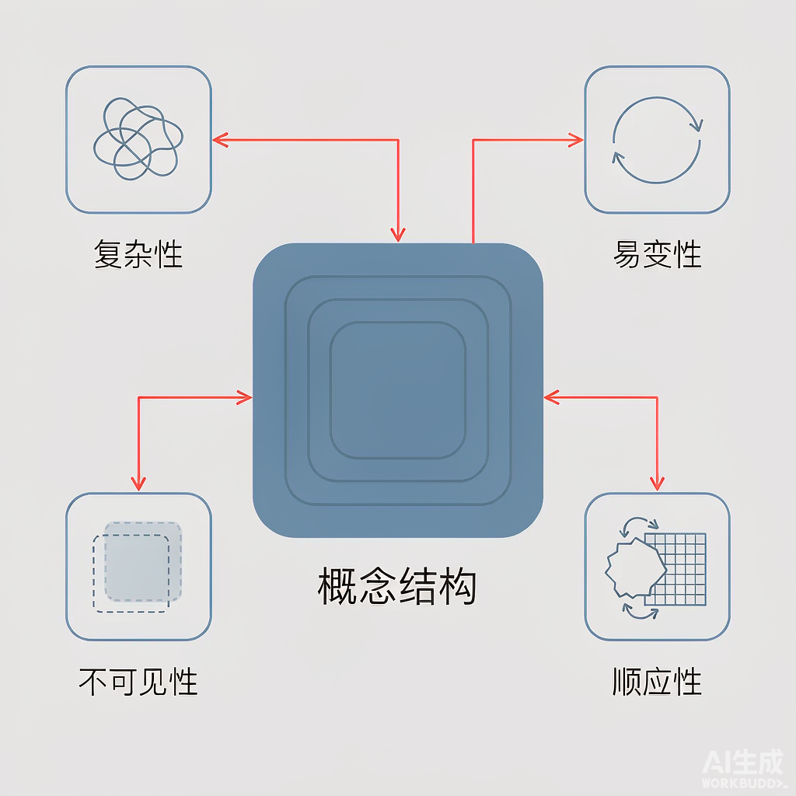
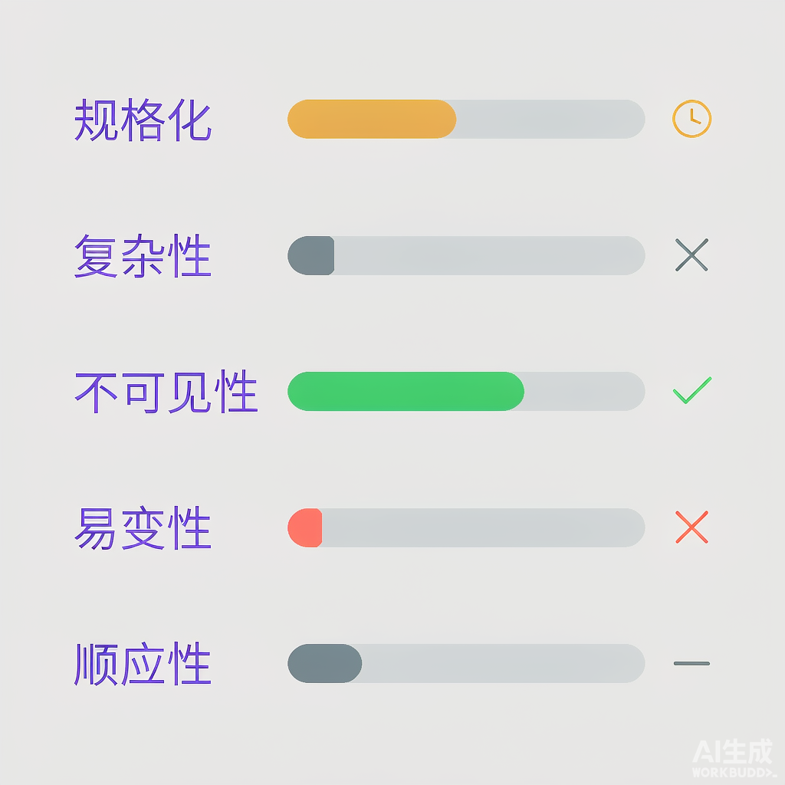
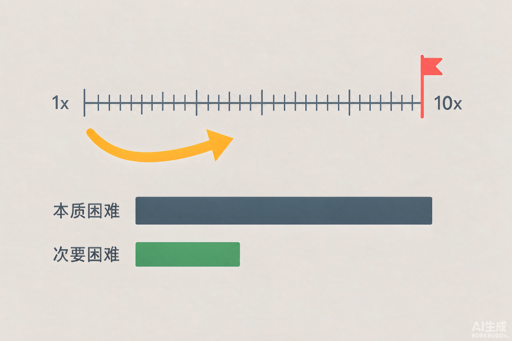

上周五，OpenAI 发布了最新的 GPT-6 Astra 模型，伴随发布有一条非常醒目的口号"Welcome to the AGI era"（欢迎来到 AGI 时代）。若是真达到了 AGI 水平，也就意味着 AI 能完成人类能做的绝大多数认知任务，包括编程任务。所以 AI 是不是新时代下软件工程的银弹呢？

**按 Brooks 对银弹的定义，当前的 AI 仍然不是软件工程的银弹**——但它把软件工程中"次要困难"的天花板抬到了前所未有的高度，并且在个别本质特性上，已经开始出现实质缓解。

要判断这个结论是否成立，得先把判据立清楚：什么叫银弹，软件工程到底难在哪，然后再看 AI 究竟动了哪一块。

# 一、银弹是什么

银弹的说法来自 Fred Brooks（《人月神话》作者）1986 年的著名文章《没有银弹：软件工程中的根本与次要问题》。银弹是一种比喻，但 Brooks 给它定了一个很硬的标准：**任何一种单一的技术或管理方法，能在十年内让软件的生产率、可靠性、简洁性提升一个数量级（10 倍）**，才配叫银弹。注意是"数量级"，不是"有改善"。

之所以用这个比喻，是因为 Brooks 注意到软件开发演变成灾难的过程，与狼人变身十分相似。一个看似简单的软件项目，可以突然变成进度落后、超出预算、存在大量缺陷的怪物；这种现象被 Brooks 类比为狼人变身。对付狼人，可以用银弹射杀它。对应到软件工程中，人们也一直期待能找到一颗银弹，一枪解决软件开发成本居高不下的问题。

而这个判据的关键落点，在于 Brooks 对困难的两分：

-   • **本质困难（essence）**：软件本身在**概念构造**上的固有困难——即如何从抽象的现实问题，发展出具体的概念解决方案。
    
-   • **次要困难（accident）**：把概念方案落到计算机上时所遭遇的困难——语言、工具、编译、调试、环境配置等。
    

Brooks 的判断是：过去几十年的技术突破（高级语言、操作系统、IDE、面向对象）几乎全部攻克的是**次要困难**；而只要本质困难仍占软件开发工作量的 10% 以上，那么即便把次要困难全部消灭，也不可能带来一个数量级的提升。

**因此，判断 AI 是不是银弹，只需看两件事：**

1.  1\. 它有没有攻克本质困难？
    
2.  2\. 如果没有，它至少大幅消减了次要困难吗？（这决定它是"不是银弹"，还是"连好工具都算不上"）
    

下面先说清楚本质困难是什么，再拿 AI 来逐项对照。

# 二、软件工程的本质困难是什么

## 1，软件工程的目标在于构建软件概念结构

软件工程交付的产品，从抽象层面来说，是一个由软件实体构建的概念结构。它包括：数据集合，数据之间的关系，算法，功能调用等等。这一系列因素都是思维产物——概念。同时它又类似建筑物，具有结构。因而被称为软件概念结构。

构建软件概念结构的过程可分为三个阶段：**规格化、设计与测试**。规格化是把模糊、混乱的现实业务问题与人类意图，精确化、无歧义地定义为计算机需要的"概念结构"；设计是把这个概念结构分解为可实现的模块与接口；测试则是对实现的逼真程度进行验证。

在这三个阶段中，**规格化是最困难、也是最起决定性的一环**。这有三个理由：

-   • **需求本身是模糊且自相矛盾的。** 需求方往往说不清自己究竟要什么，不同干系人的诉求还会互相冲突；规格化就是把这些混沌"逼"成无歧义定义的过程。
    
-   • **规格错误的代价最高。** 实现错了可以改代码，规格错了要推倒重来——而且错误发现得越晚，返工成本越是呈数量级上升。
    
-   • **错误会沿链条逐级放大。** 一个错误的规格会被设计忠实地实现、被测试忠实地验证，最终产出一个"运行完全正常但毫无用处"的系统。
    

这就好比建房子，绘制出建筑图纸是最重要的部分，实际开工建造反而是次要的。

## 2，软件工程的四个本质特性

软件概念结构规格化困难是由于软件具有下面四个本质特性导致的结果。

### 2.1 复杂性

复杂性是软件工程的一个本质属性，这一点与其他工程系统存在较大差异。其他工程系统也存在复杂性，但可以通过一些通用的底层原理与数学模型，把复杂度收敛在可以安全掌握的范围内——比如一根梁的受力可以用欧拉-伯努利方程描述，一个电路的电流电压受基尔霍夫定律约束。软件工程却缺乏这样一种能把复杂度**降维**的通用规约。

这种无法降维的复杂性来源于 3 个方面。

**1，规模非线性：不具备"空间重复性"**

在传统工程中，规模的扩大往往伴随着大量的几何重复或同构扩展。例如建造一座 100 层大楼，并不需要 100 种不同的力学结构。

软件中的扩展却不是重复扩展。若两段代码相同，工程师就会立刻将其重构，抽象为函数或模块。但这消除的是**代码文本**的重复，不是**概念**的重复——一个规模膨胀为 10 倍的系统，新增的几乎全是彼此异构的元素，元素之间的交互关系随规模呈**组合级数**增长（大致在 O(n²) 量级）。

需要说明的是，软件工程对抗这种增长的主要手段恰恰是**模块化与抽象**：把耦合限制在清晰的接口之内，把组合级的交互压回接近线性。但模块化本身又是一件需要高度判断力的脑力活——它降低的是复杂度的**增长速度**，而不是消除复杂性本身。

**2，状态离散与脆弱：缺乏物理世界的"连续性保护"**

物理工程遵循物理规律，通常具有连续性与容差。桥梁承受的载荷微增 1%，产生的微小形变仍处于安全裕度内，不会引发突变。

软件是纯粹的离散状态机，它**不像物理世界那样自带容差**——在数百万行代码中，仅仅漏掉一个指针检查、颠倒一个布尔条件，就可能导致整个系统崩溃。物理世界的容错来自自然定律，软件的容错必须**人为额外设计**（冗余、重试、熔断、隔离、优雅降级），而这本身就是一笔持续付出的成本。

**3，无法用低维模型降维表达**

其他工程学科的复杂性受制于底层的自然法则，因而总能找到一套简化的建模工具。软件系统的逻辑并不源于自然定律，而是源于人类任意设定的业务规则、制度、法律与随意性接口。这些规则充满了特例、历史妥协和人为断裂点，找不到一个统一的公式把它们压缩掉。

软件工程构建的是没有物理实体的纯思维产物，它的异构性、离散性和人为随意性，使其复杂性成为了本质特征。

### 2.2 不可见性

不可见性是软件工程的另一大特性。这主要是由于软件由相互关联的非空间概念构成，天然排斥单一维度的视觉化。

软件同时存在数个相互交错、且完全不同维度的视角：

-   • 控制流：代码的执行路径与跳转分支。
    
-   • 数据流：数据如何在函数与缓存之间转换、流转。
    
-   • 依赖拓扑：类、包或微服务间的调用与绑定关系。
    
-   • 时序与并发状态：多线程或分布式节点在时间轴上的竞态与锁竞争。
    

没有任何一张统一的视觉图能同时容纳这些维度。只看控制流，就丢失了"数据结构的变化"；通过类图观察静态结构，就完全看不到"运行时的内存分配与并发竞争"。这就像只能通过几张互不同向的截面图去推断一栋楼的三维结构——每一张都对，但没有一张是整体。

不可见性给软件工程带来了以下困难。

**1，严重制约人类大脑的思维与交流**

人类大脑进化出强大的视觉与空间认知能力，擅长通过"看空间结构"发现问题。但面对代码，无法应用这一机制，只能在大脑中建立高度抽象的虚拟运行。这种方式容易出现心智过载与死角。

**2，导致"概念完整性"极易崩溃**

这里说的"概念完整性"，指的是一套系统的设计必须由极少数人（理想是一到两个）主导，保持架构在概念上的统一与简洁。由于系统在整体上是看不见的，随着团队规模扩大，架构师和程序员往往只能看到自己负责的局部，各自脑内的模型又无法拿到桌面上比对；不同模块就以未曾料想的方式耦合，直到联调或线上崩溃时才会暴露。

### 2.3 易变性

易变性指的是软件实体承受着极其巨大、且永无止境的修改压力。这主要由下面 3 个因素决定。

首先，软件中的"软"就体现在它天生比硬件容易修改——它是纯逻辑集合，没有物理实体需要重铸。

其次，软件的成功会催生出新的需求。软件是一个自动化系统，一旦搭建成功后，用户会迅速适应新的能力边界，并立刻产生更高级、更深度的诉求。也就是说，软件解决了一个问题，往往会暴露或催生出**一批**新问题。因而软件的成功，本身就蕴含着促使其变更的动力。

最后，软件依赖的环境（硬件、操作系统、外部系统、法律法规等）一直在演化迭代，为了不断适配新环境，软件就需要不断改造。

### 2.4 顺应性

顺应性是指软件必须迁就那些并非由它自己决定的、已经存在的东西。这个特点主要表现在下面两个方面。

**1，迁就人为的制度与既有接口**

软件必须服从外部接口、法规和人类机构的各种要求，而这些要求往往不遵循任何内在逻辑，仅仅因为"它已经是这样了"。物理学不需要迁就立法，软件需要。

**2，兼容遗留系统的规则**

新系统诞生的第一天，就被带上了镣铐。它必须花费可能一半的时间，去兼容遗留系统的数据格式、各种奇怪的协议和外部依赖的缺陷。这是对现实情况的妥协与顺应。

## 3，现有解决方式的天花板

面对上述困难，软件工程并非毫无办法。过去几十年积累下来的主要手段是：**模块化与抽象**（把复杂度关在接口里）、**分层**（一次只应对一个抽象层级）、**复用**（用成熟组件替代重新发明）、以及**形式化方法**（用数学规格与验证换取确定性）。

但要看到这些手段的共同边界：它们全都是在**管理**本质困难，而不是**消除**它。模块化降低了复杂度的增长速度，却不能让业务规则变简单；分层降低了认知负担，却不能让软件变得可见；形式化方法能提高确定性，但把现实业务写成形式化规格的成本，往往比直接写代码实现它还高。

这条边界也划出了一根评估新技术的标尺：**任何技术（包括 AI），如果只是沿着这条线做得更快，那它攻克的是次要困难；只有让"规格化、设计、验证"这件事本身变容易，才算真正触碰本质。**

# 三、对照判据评估 AI

## 1，本质困难：尚未攻克，但已开始被部分逼近

当前 AI 仍然没有攻克软件工程的本质困难，但也并非毫无进展。更准确的说法是：**它已经在边缘处逼近了，却始终跨不过"由谁来决定构建什么"这道门槛。**

**在"规格化"上**，AI 起到的作用主要还是在**人类给定的问题框架内求解**，而不是替人类决定"究竟该解决什么问题"。软件构建过程中最困难的任务，是准确决定要构建什么；而现实中的需求往往充满模糊、矛盾甚至自相冲突的逻辑。最终的价值判断与取舍仍必须由人承担——而这恰恰是本质困难的核心。

不过这里要说句公道话：AI 确实开始**部分逼近**了。它能把一段模糊描述在几分钟内变成可运行的原型，让需求方看到真实效果后，反过来澄清自己到底要什么。这大幅缩短了"需求—反馈"的循环，是过去做不到的。但它加速的是**澄清**的过程，并没有替人**决定**。

**在复杂性上**，AI 没有消除复杂性。三个分项逐一对照：

-   • _规模非线性_：AI 能快速产出代码，但"识别模块、定义接口、控制耦合"这些决定复杂度增长速率的关键判断，仍依赖人的架构能力。AI 生成的模块边界往往不够干净，反而可能让交互关系增长得更快。
    
-   • _离散脆弱_：用"是否 100% 正确"衡量 AI 其实是个双重标准——人类同样做不到。真正的判据是：AI 的缺陷密度是否显著低于人类，以及这些缺陷能否被测试、评审、CI 等既有流程兜住。就目前而言，AI 在**长链路、跨模块的逻辑一致性**上仍明显弱于资深工程师——一个在局部看起来完全合理的函数，放到全局可能破坏一条不变量。这才是离散脆弱性未被解决的地方。
    
-   • _无法降维_：AI 也没有为软件找到那套"欧拉-伯努利方程"。它能熟练地写出业务代码，但没有把业务规则压缩成可推演的模型。
    

**在不可见性上**，这是 AI **确确实实带来部分缓解**的一项。把一串代码即时转成控制流图、依赖关系图、时序图，或者用自然语言解释一个陌生模块在做什么——这些正是"让不可见变得可见"的工作，而且成本从"小时级"降到了"秒级"。

但边界也要说清楚：AI 生成的是**某一个维度的一张视图**，它既不能把四个维度合成一张图，也不能替人建立整体的心智模型。它降低了"看某一面"的成本，没有解决"看不全"这件事。

**在易变性上**，AI 无法**消除**变更带来的腐化压力；恰恰相反，由于 AI 生成代码的速度远快于人类建立整体心智模型的速度，如果缺少强架构约束，AI 辅助的系统可能**更快**地腐化为无人敢动的黑盒。这里的前提是"缺乏全局一致的概念完整性"，而这一点 AI 目前确实无法替人保证。

**在顺应性上**，需要区分两类规则。**已被记录**的规则——写在文档、代码、issue 里的那些——AI 反而很擅长消化；读懂一座遗留系统并遵守它的规矩，正是 AI 最实用的场景之一。真正无法推导的，是那些**只存在于人脑中的隐性规则**与尚未成文的组织妥协。对这些，AI 至多帮你写出一长串兼容逻辑，而不能消除这种复杂性本身。

> 小结：四项本质特性中，AI 在"不可见性"上带来了实质缓解，在"规格化"上带来了流程加速，但在复杂性与易变性上没有取得根本突破，在顺应性上只能代人写出兼容逻辑。**本质困难总体上未被攻克。**

## 2，次要困难：被大幅消减

如果说在本质困难上 AI 只是"逼近"，那么在次要困难上，它是**碾压式的**。

**1，原型构建**

从零写一个脚本，做一套前后端原型 demo，用不熟悉的语言快速拼装一个独立工具。在这些场景中，没有历史负债，代码写错大不了推倒重来。使用 AI 可以极大地提升生产效率。

**2，语法与 API 翻译**

将一份 Python 代码翻译成 Go，从"我想统计各数据文件中 word 一词出现的所有次数"到生成直接的 bash 语句。这类纯语法映射劳动几乎能被 AI 压缩到零摩擦。

**3，单兵全栈化**

对原本只懂后端的资深工程师来说，AI 能够让其在几乎不查文档的情况下独立完成前端交互甚至运维脚本，消除了小团队因技能拼图不齐而产生的人际协作成本。

按 Brooks 的框架，这三项都属于次要困难。它们的共同特点是：**"要做什么"已经明确，剩下的只是把它表达出来**。而 AI 恰恰极其擅长"表达"这一环。

# 四、总结

AI 是一种极强大的生产力放大器。它把软件工程中"次要困难"的成本压到了历史最低点，在"不可见性"这项本质特性上也带来了实质缓解；但它没有让"规格化、设计、验证一个软件概念结构"这件事本身变容易——决定"究竟该构建什么"的价值判断仍由人承担，软件的复杂性与易变性也没有被根本解决。

**所以，按 Brooks 的数量级标准，AI 不是软件工程的银弹。**

最后再畅想下未来真的达到了AGI程度的话，AGI会不会成为软件工程的银弹？

-   • **如果银弹指的是"消除软件固有的本质困难"**——那么答案仍然是否定的。软件的复杂性、易变性来自它所要解决的人类世界本身，而不是来自做这件事的人的智力水平。再强的智能也只能应对，不能消除。**本文采用的是这个定义。**
    
-   
    
-   • **如果银弹指的是"免除人类承担这些困难的成本"**——那么当软件工程真的不再需要人类参与时，对人类而言它确实"像"一颗银弹。
