## **引言**

AI 工具现已嵌入 Uber 软件开发的每个阶段。超过 70% 的拉取请求归因于本地或云端代理。工程师们已在软件开发生命周期中构建了超过 3,600 项代理技能，并每天执行超过 30,000 次代理技能调用。

在 AI Engineer 2026 大会上，我们分享了[我们的愿景](https://youtu.be/17-YSUHo6Lk?si=EbqFAc2UwHX_3wSc)，即软件工厂以及我们在整个生命周期中构建的构建模块和托管代理。随着我们朝着这一愿景迈进，越来越多的会话并非由人类发起，而是由自动化托管代理处理，包括代码审查、自愈 CI 失败、通过视觉验证完成端到端 PR、分类值班警报、调试传入的 bug，以及处理各种代码维护任务（需人工审查/升级）。

如图 1 所示，从 2026 年 2 月到 8 月，我们所有员工（工程师和非工程师）在所有代理产品中的每周活跃用户增长了 7 倍，每周代理请求增长了 9.4 倍。与此同时，由于全面的优化，我们的 AI 总支出自 4 月以来已相对稳定。

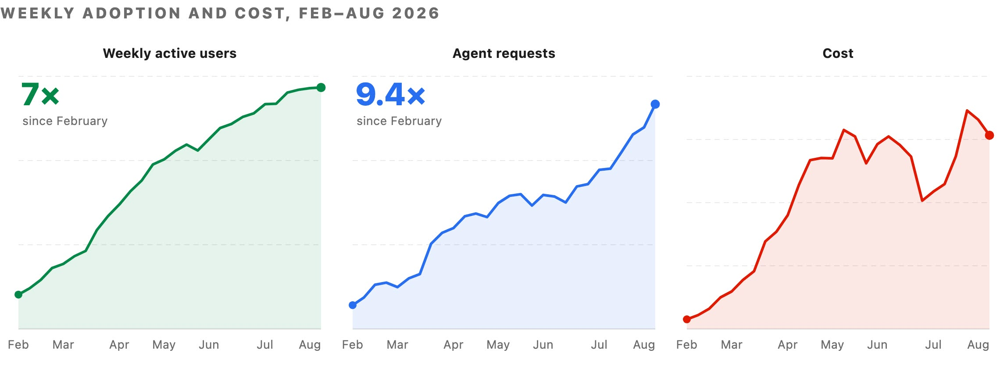

图 1：2026 年 2 月至 8 月中旬的每周活跃用户、代理请求和成本，用户已跨工具去重。

由于采用率、工作负载组合和模型升级都在不断变化，要隔离我们自身的优化收益，就需要固定一个模型，因为每次升级和模型系列都会导致行为变化。我们在 2 月到 7 月期间这样做了：每 1,000 个模型请求的成本比峰值下降了近 34%，每次会话的成本比 6 月峰值下降了 52%。

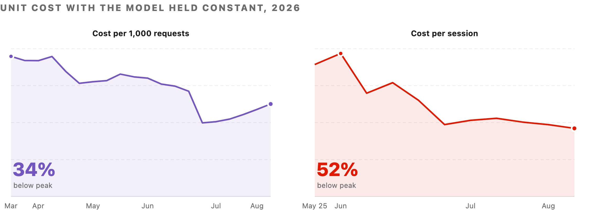

图 2：模型保持不变时的成本优化影响。\*每次会话成本数据从 5 月底开始。

这篇博客将介绍我们如何思考我们的软件工厂：代理会话运行的四个层级、我们用来分解支出的成本方程、我们如何衡量每一项，以及我们如何在每个层级优化这些项。

本比较中的所有定价和供应商指标均基于公开信息，成本效率的提升是通过在标准层级定价内更智能地路由我们内部的 Uber 工作负载来实现的。虽然我们衡量的具体成本降低是我们环境所特有的，您的实际情况可能因代码库、团队规模和代理工作流而异，但基准测试实际工作并针对准确性和成本进行优化的方法论是普遍适用的。

### **软件工厂及其成本方程**

#### **代理使用的四个层级**

我们将 AI 使用分为四个层级，从最专门到最通用。如图 3 所示，层级越高，我们对成本、质量和模型选择的控制力就越强。

####

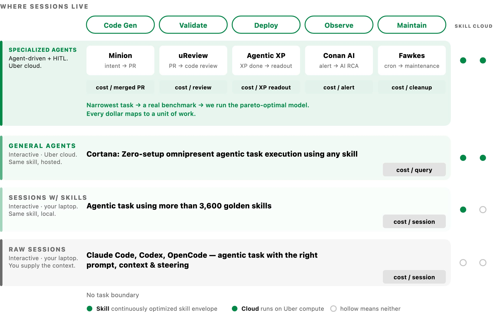

图 3：代理会话运行的四个层级。

**成本方程**

在上述任何层级中，我们都可以将代理会话的成本分解为以下项，我们可以独立衡量和优化这些项。

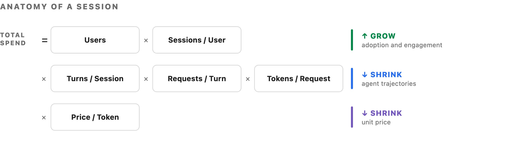

图 4：总支出，分解为六个相乘的项。

前两项代表采用率和参与度，我们希望在整个用户群中保持增长，无论用户是交互式使用，还是代理代表他们处理任务。中间三项提供了优化的机会：代理代表自身所做的工作，以及工程师实际发出的请求之上的工作。这是我们大部分工作的重点。这包括帮助代理更快规划、减少不必要的轮次或错误、优化输入令牌等机制。

### **我们如何衡量**

以下是我们每周和每月跟踪的完整指标集，使我们能够进行短期和长期的预测与规划。

**层级**

**指标**

**回答的问题**

**组合**

-   总归因成本
-   去重归因用户
-   每个工具/代理的成本、用户和支出份额

资金流向何处，以及哪个工具发生了变化

**单位经济性，按工具**

-   每用户成本
-   每用户请求数
-   每 1,000 个请求的成本
-   每个请求的输入、输出和总令牌数
-   每 100 万个令牌的成本
-   每 1,000 个会话的成本
-   每活跃会话小时的成本
-   提示缓存命中率

该工具是否变得更便宜，或者只是使用量在转移

**模型经济性**

对于每个模型

-   成本和成本份额
-   请求数和请求份额
-   每 1,000 个请求的成本
-   每 100 万个令牌的成本

哪些模型发布实际上改变了账单，在相同或不同的每令牌价格下

**驱动因素分解**

成本变化按顺序分解为

-   采用率（用户）
-   参与度（每用户请求数）
-   输入工作负载（每个请求的输入令牌数）
-   输出工作负载（每个请求的输出令牌数）

数字为何变化，精确说明，不留任何无法解释的残余

**托管代理结果**

对于每个托管代理：

-   按结果计量的成本（每个合并 PR 的成本、每次审查的成本、每次警报的成本、每次清理的成本）；
-   质量信号（回滚率、F1、MTTR）；
-   数量（落地的差异、发布的审查、分类的警报）

每个托管代理在交付的每单位价值上是否变得更便宜，以及质量在模型迁移中是否保持

### **优化杠杆**

在以下部分，我们详细介绍了用于优化成本方程每个部分的关键杠杆。其中一些杠杆影响成本方程中的一行或多行。

价格 / 令牌

基于基准测试的帕累托最优模型选择

模型默认值

令牌 / 请求

默认 400K 上下文上限和中等推理力度

提示缓存

工具搜索和 CLI 解析的 MCP 调用

工具调用的代码模式批处理

网关路由的 SaaS MCP

请求 / 轮次

基于图的上下文

持续技能优化

可见性与教育

状态行中的实时成本计数器

可见性和支出层级

会话分析仪表板

### **优化价格 / 令牌**

供应商设定令牌价格。我们选择哪个模型运行哪个工作负载。在我们所有托管代理的层级中，我们为该工作负载选择最帕累托高效的模型。对我们来说，帕累托高效意味着成本/完成任务、输出质量和模型可靠性。

#### **基于基准测试的模型选择**

模型选择分四步进行，对我们运行的每个托管代理都是相同的。

-   从代理的真实工作构建基准。
-   在支持任何模型（前沿或开放权重）的测试平台上运行代理，统一接口。
-   转向任何帕累托最优的模型，并持续移动。前沿每几周就会变化。

展望未来，我们通过利用托管代理的聚合洞察，不断优化我们的工作负载性能，以测试和部署各种模型路由策略。

例如，我们使用 uReview，它处理所有拉取请求的 AI 代码审查。我们使用包含已知 bug 的真实拉取请求构建了其基准，并将它们评为简单、中等和困难。我们针对这些 bug 评分精确率、召回率和 F1，以及每次审查的成本、延迟、超时和噪音。如图 5 所示，切换模型提高了我们的 F1，同时大幅降低了每次 PR 的成本。在图中，虚线是帕累托前沿。其下方和左侧的所有内容都被更便宜或更好的方案所超越。

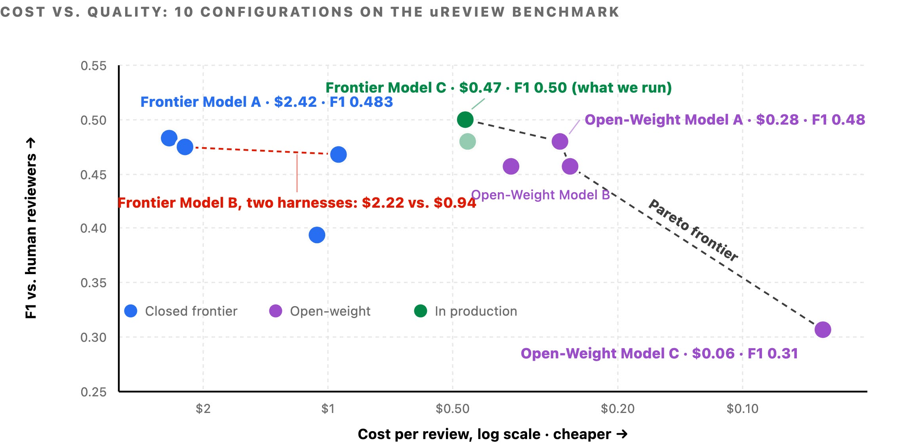

图 5：我们为 uReview 测试的每种配置。

使用我们大型单体仓库中数千个真实世界的 PR，我们在内部还运行着一个 Uber SWE Benchmark，用于评估不同任务类型下的前沿模型和开放权重模型。我们用它来为所有由 SDLC 管理的代理提供模型选择依据。

#### **默认模型选择**

在交互式界面中，token 单位成本保持固定；但是，你可以通过策略性地管理跨模型的 token 分配来优化成本。两个默认设置主要控制这种分配：初始会话模型和子代理模型。

子代理默认设置已被证明是最有效的杠杆，而且其重要性还在持续增长。随着最新模型能力支持更高效的多代理编排，发起子代理的会话比例稳步上升。由于子代理执行的是输入明确、定义良好的任务，通常不需要前沿级别的推理能力，因此我们默认将它们配置为较弱但更具成本效益的模型，同时仍然允许手动覆盖。主模型负责任务分解和评估，而子代理负责执行工作。

### **优化 Token / 请求**

每一轮都会重新发送完整的对话历史、项目上下文和工具结果。任何能减少单次请求负载的措施都会在会话过程中产生累积效应。

#### **默认配置**

所有交互式工具都使用统一的封装器进行安装管理、配置、身份验证和成本可见性。两个标准化的默认配置直接减少了每次请求的 token 消耗：

-   **即使对于 100 万上下文窗口的模型，也会在 40 万 token 时触发自动压缩：** 这个阈值在模型性能与缓存突发和重复输入 token 成本之间取得了平衡。我们的测量显示，整个集群中每次请求的输入 token 数量显著减少。
-   **推理强度默认为中等：** 输出 token（包括内部推理 token）在主模型上的计费倍率高于输入 token；这一策略调整直接降低了成本最高的 token 类别的支出。对于大量任务类型，中等推理强度在成本与质量之间达到了良好的平衡。

#### **提示缓存策略**

我们的提示缓存策略由提供商提示缓存读取和写入的经济性驱动。由于每一轮都会重新传输完整的对话历史，缓存先前上下文可以避免重复支付全部成本，将后续读取成本降低到标准输入 token 费率的 0.1 倍。然而，写入溢价各不相同：5 分钟缓存条目的成本为 1.25 倍，而 1 小时条目为 2 倍。因此，选择最优 TTL（生存时间）取决于轮次之间的间隔时长。可用的 TTL 选项包括 Anthropic® 提供的 5 分钟和 1 小时，以及 OpenAI® 提供的 30 分钟。

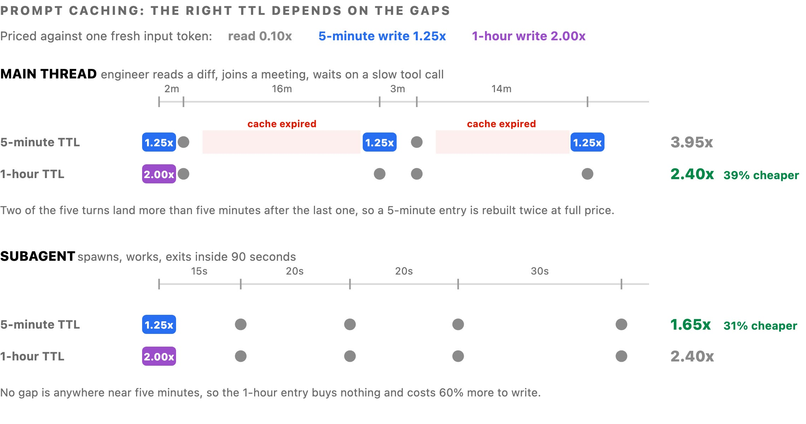

图 6：两种 TTL 时长下各 5 轮对话的成本对比。

由于工程师经常让交互式会话空闲超过 5 分钟，我们将默认的 5 分钟 TTL 切换为 1 小时窗口。这些频繁的空闲间隔之前会使前缀缓存失效，迫使系统以全价重建上下文。相比之下，子代理保留 5 分钟的缓存 TTL，因为它们的执行范围仅限于单个短期任务。

#### **通过 Shell 执行 MCP 工具**

在 Uber，所有 MCP（模型上下文协议）交互都通过一个统一网关进行路由。这个单一入口点涵盖了内部和第三方 SaaS MCP 的 1,000 多个 MCP 服务器，实现了集中式身份验证和策略执行。

然而，标准 MCP 会将所有工具模式直接加载到每个会话中，无论工程师在该会话中是否会调用它们。例如，安装了 100 多个工具后，这种预加载会在初始提示中添加约 50K-70K token 的模式开销，并且这些开销会在每一轮上下文轮转中重新发送。

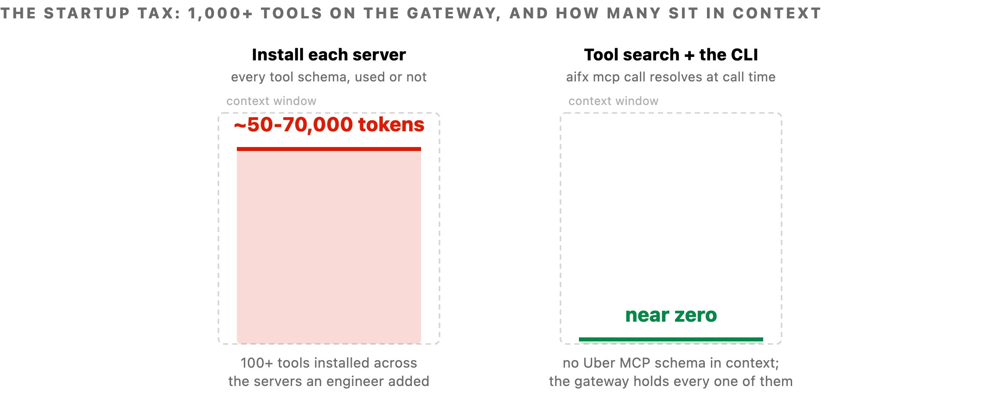

图 7：在三种访问相同工具的方式下，代理在会话开始时已经携带的内容。

为了解决这种上下文膨胀问题，我们引入了两种互补的优化机制：

-   **CLI 工具解析**：用允许模型执行 shell 命令的方式替代直接 MCP 集成。CLI 在调用时动态地通过网关解析并调用所需工具，从而将会话上下文中的 Uber MCP 模式消除。来自我们内部 MCP 网关的所有 1,000 多个 MCP 工具都以 CLI 命令的形式呈现。
-   **工具搜索**：通过允许模型搜索工具目录并按需仅加载所需工具，扩展到数千个工具。这种方法减轻了上下文膨胀，通常能减少工具定义的 token 使用量，并且即使可用工具库不断扩展，也能保持高选择准确率，防止与大型工具集相关的性能退化。

#### **代码模式**

当工具以 shell 命令的形式直接调用函数时，模型可以在单个脚本中批量执行多个操作。这种批处理对于对话频繁的工具协议尤其有利。在标准 MCP 工作流下，每个操作都需要单独的模型轮次来发出请求、将原始响应加载到上下文窗口中，并顺序处理结果。例如，执行单个 SQL 查询需要提交请求、轮询状态 2 到 5 次，然后获取输出。代码模式将整个流程简化为一个自动化的 Python 循环，将中间轮询排除在模型的活跃上下文之外。如图 8 左侧所示，模型参与轮询循环，每个响应都会进入其上下文。在右侧，循环在子进程中运行，只有摘要返回。

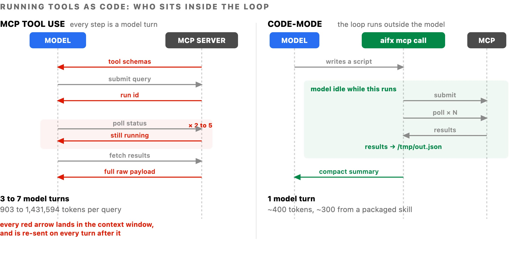

图 8：同一个仓库查询的两种执行方式。

我们通过在同一个会话中通过两条路径运行 5 个相同的 SQL 查询来测量这一点：

**查询**

**LLM 工具使用**

**代码模式**

**节省**

SELECT 1（1 行）

903

402

55%

COUNT(\*)（1 行）

954

403

58%

GROUP BY LIMIT 20（20 行）

1,600

457

71%

SHOW COLUMNS（175 行）

2,200

900

59%

SELECT \* 宽表（50 行）

1,431,594

900

约 100%

每次查询的 token 数，在同一个 Claude Code 会话中测量。

前三行突出了主要发现：即使对于远低于响应大小限制的最小结果集，代码模式也能将 token 使用量减少 50% 以上。这些效率并非来自绕过大数据负载，而是来自消除不必要的开销，包括模式初始化、多轮轮询和冗余的逐步推理。

批量工作流会放大这种效果，因为原本需要 N 个模型轮次的循环变成了一个脚本，节省效果累积到 90% 以上。通过为我们最常访问的 MCP 服务器部署 25 个以上的预构建代码模式技能，我们确保标准工作流默认走最具成本效益的路径。

#### **SaaS MCP**

管理第三方软件被证明比管理我们的内部服务器更具挑战性。供应商设计 MCP 服务器时倾向于暴露完整的产品能力，因为他们无法预测客户的具体使用方式。例如，一个工作区套件将 49 个工具捆绑到单个服务器中，需要约 22K token 的模式开销，而消息传递和项目跟踪供应商分别提供 34 个和 46 个工具。加载两到三个供应商服务器后，代理在用户输入提示之前就已经携带了比正在编辑的文件更多的模式开销。

为了解决这一问题，我们通过MCP网关路由SaaS MCP服务器，采用与内部MCP相同的机制。同时，我们将所有这些MCP作为CLI暴露，供任何智能体界面调用。此外，我们在代码模式插件中为每个服务器编写了专门的技能，以封装常见工作流。这就在众多SaaS供应商中解锁了高效的智能体工作流。

###

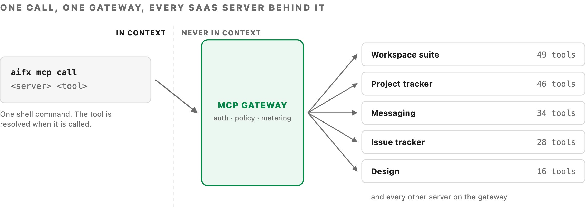

图9：每个SaaS MCP服务器都暴露在我们的MCP网关之后，以确保统一、高效的访问模式。

**优化请求/轮次**

无依据的智能体失败时是缓慢而非廉价地，它会反复发送不断扩大的上下文窗口，以搜索更多位置。预先提供更丰富的信息仍然是减少这种搜索开销的最有力杠杆。

#### **上下文工程**

在Uber庞大的代码库和数据生态系统中，涵盖数亿行代码和数千张表，智能体大部分轮次都花在定位信息上，而非生成代码。为解决此问题，我们构建了AI上下文图：一个统一网络，包含2400万个节点和8000万条边，跨越86种节点类型和117种边类型。它整合了来自30多个内部系统的数据，包括服务、工程团队、事件日志、拉取请求、架构设计文档、部署、数据集和历史表使用查询，并允许任何智能体用自然语言查询它。

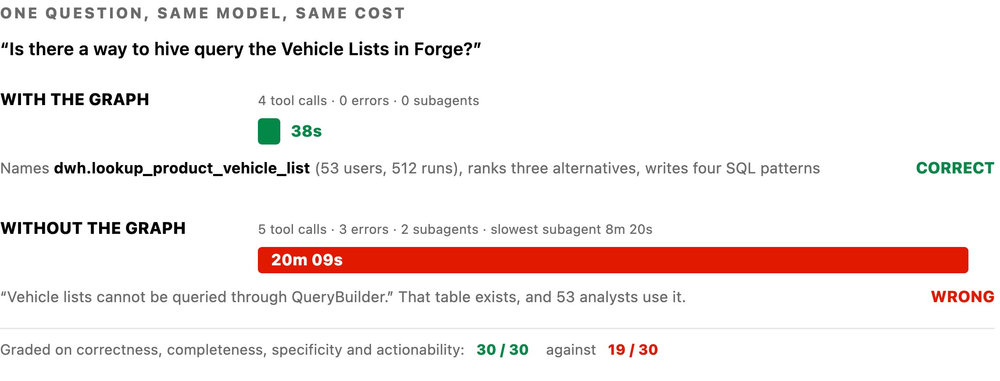

图10：比较相同提示词提交给相同模型时，有无图依据的执行路径。

有依据的智能体查询了历史使用情况，识别出超过50位分析师使用的特定表，并在38秒内给出了答案。相反，无依据的智能体无法看到该表；它花了20分钟检查服务代码，生成了2个子智能体，遇到3个错误，最后错误地得出结论该数据集不可查询。

### **可见性与教育**

这里的杠杆是可见性和反馈循环，帮助工程师和智能体更快收敛。

#### **状态行**

我们在工具状态行中放置了一个实时成本计数器，跟踪每个工具以及每个用户所有工具的总实时支出。

###

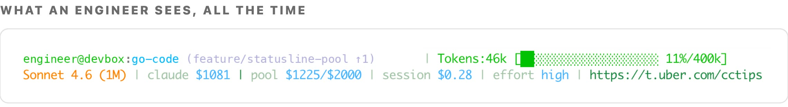

图11：状态行，以及随附的会话分析器和效率指南。

**可见性与支出层级**

为避免实施严格上限，我们实现了实时支出跟踪和自动提醒：

-   **状态行实时计数器。** 运行中会话成本始终在终端可见。
-   **工具池。** 所有交互式工具共享一个层级，而非按工具预算。托管智能体有单独层级。
-   **Slack提醒。** 在预期支出的50/80/100%时发出警报，让工程师有时间规划。
-   **简便审批流程。** 经理批准层级升级，并快速传播。
-   **成本检查技能和提示。** 一个仪表盘技能，用于按需成本分解和实时状态行指导。

这些使工程师能够独立评估任务ROI，同时控制失控支出。

#### **会话分析仪表盘**

虽然状态行突出显示会话的总支出，但它无法洞察成本驱动因素或可操作的效率步骤。一般指导提供高层原则，但无法评估个别开发人员的工作流。会话分析仪表盘通过直接检查会话工件来弥合这一差距。

它直接内置于运行时，无需设置或选择加入。执行_成本仪表盘_技能会分析用户在所有本地和远程云沙箱中，跨其使用的所有工具的会话轨迹。它不是生成一个汇总指标，而是标记跨会话的16种不同反模式，将每种模式与其财务影响和针对性修复措施配对。其中一些类别包括：

-   **次优模型路由：** 在Opus上执行Sonnet即可轻松完成的简单多轮会话。
-   **上下文窗口膨胀：** 大型MCP负载（例如40KB响应）持续存在于上下文中，并在后续轮次中产生重复计费。
-   **缓存过期低效：** 长时间中断后恢复会话，过期的提示缓存迫使全价前缀重建。
-   **提示初始化开销：** 在任何用户输入之前预加载100,000个令牌的系统指令和工具定义。

###

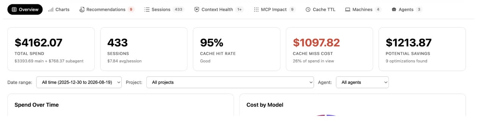

图12：会话级成本仪表盘识别浪费模式和潜在节省。

**下一步是什么？**

目前正在进行的举措包括：

-   **扩大托管智能体队伍：** 对于每个新智能体，我们遵循一致的路线图：建立目标结果指标，组装评估基准，并确定帕累托最优模型。这种系统化方法旨在将SDLC的每个阶段提升到工厂成熟度模型的更高层次。
-   **动态模型路由：** 我们正在扩展跨不同编程语言、代码仓库和智能体模式的基准覆盖。鉴于模型能力差异很大，有效的模型路由在很大程度上依赖于全面评估。
-   **深化上下文图集成：** 我们正在为更广泛的自主智能体解锁图查询能力。
-   **将会话分析演变为实时开发人员指导：** 通过从周期性批量检测反模式转向持续轨迹监控，我们旨在直接向工程师提供个性化、实时的效率建议。
-   **持续技能改进：** 我们正在研究一种自动化方法，记录智能体技能执行中的小问题，并从收集的轨迹中自动生成技能更新。

## **结论**

管理和控制不断上升的AI编码成本也是一个可处理的工程挑战。通过消除浪费的、零价值的令牌消耗，而非仅仅依赖更低的单价或降级工具，我们将使用量扩大了7倍，同时降低了所有指标的单位成本，并提高/保持了输出质量。

核心战略转变是从交互式开发人员工作流转向完全托管的智能体。将SDLC工作负载转移到托管环境，可以完全控制模型路由、执行工具和运营支出。优化一支由专门托管智能体组成的队伍，每个智能体都配有专门的评估基准和帕累托高效模型，本质上比优化数千名工程师的个别终端会话更具成本效益和可扩展性。

### **致谢**

这是许多工程师集体努力的结果，他们正在构建最高效的模块，在Uber规模上实施软件工厂，同时确保我们花费的每个令牌都能获得ROI。我们要感谢参与软件工厂各项工作的核心团队，名单如下：Abhishek Bhatia, Adam Huda, Aditya Patel, Alok Srivastava, Ameya Ketkar, Anil Purohit, Atakan Kandemir, Ben Chou, Brandon Barker, Danielle Yim, Deepanshu Mehndiratta, Gaurav Gill, Israel Marban, Jason Varbedian, Karen Xu, Lei Shi, Mager Mager, Meghana Somasundara, Peng Liu, Preet Inder, Qiushen Wang, Rush Tehrani, Shesh Patel, Shiven Tripathi, Shubham Gupta, Stas Khalup, Ting Chen, Tse-Shi Wang, Ty Smith, Vikram Hullukunte, Viv Keswani, Weiqiang Wang, Will Bond。

还要感谢Johannes Gehrke、Mattie Toia、Sumanth Sukumar和Praveen Neppalli Naga的领导。

封面图片署名：Himer Romana

_Anthropic® 是 Anthropic PBC 的注册商标。_

_Claude Code™ 和 Claude® 是 Anthropic, PBC 的商标。_

_OpenAI® 及其标识是 OpenAI® 的注册商标。_
