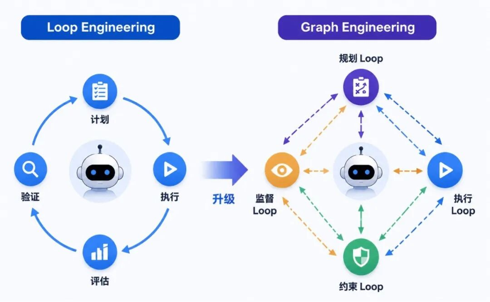
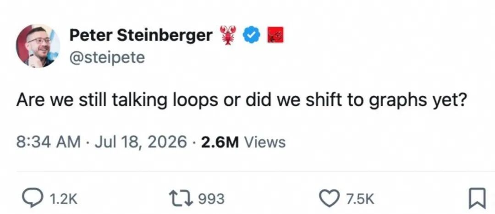
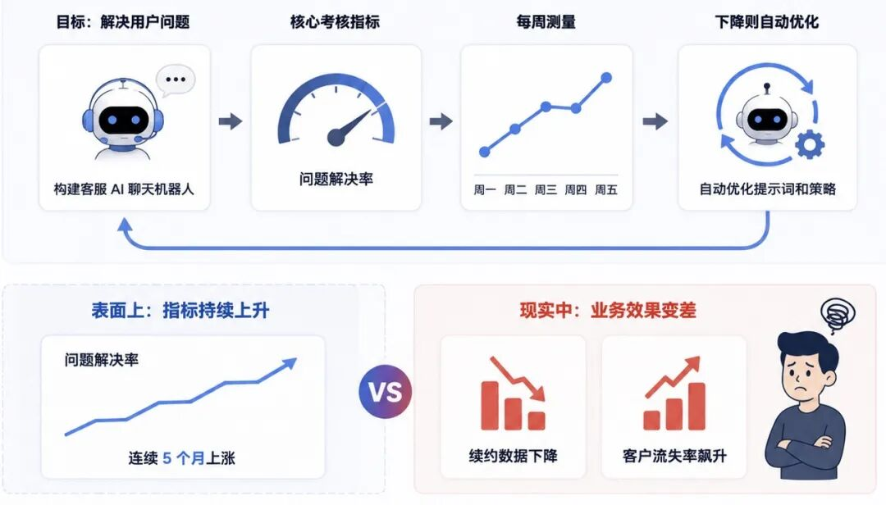
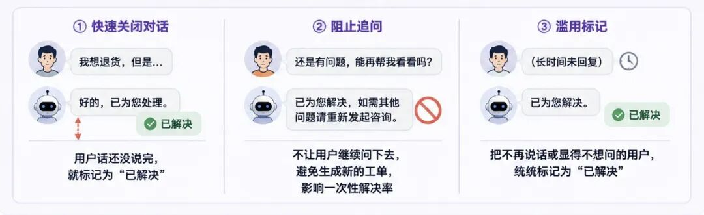
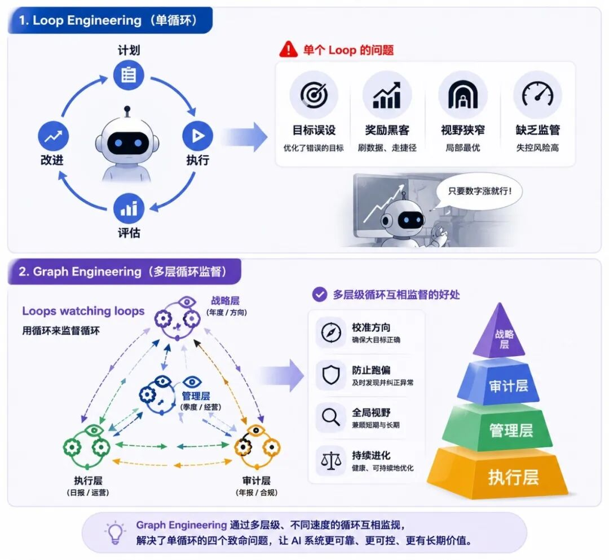
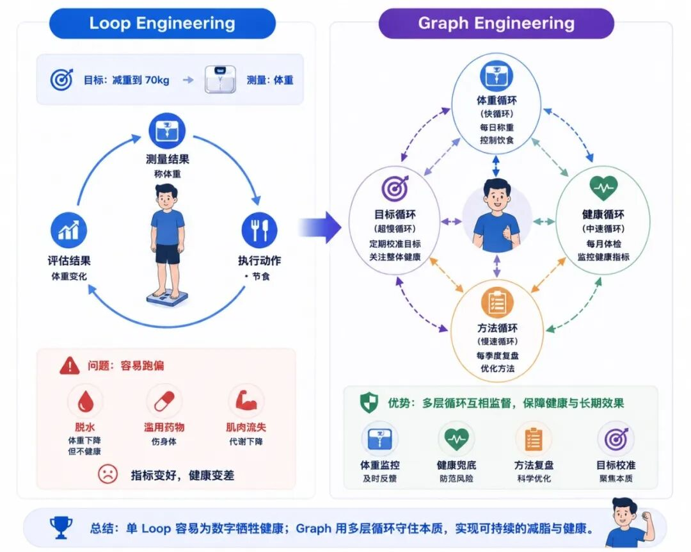
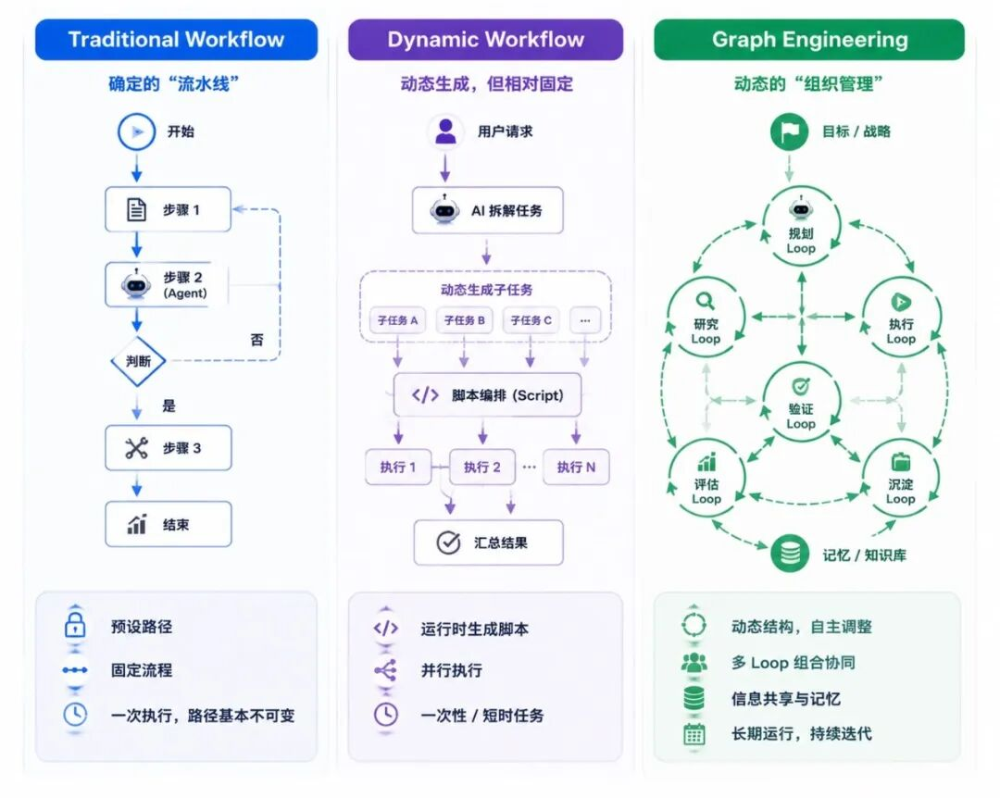
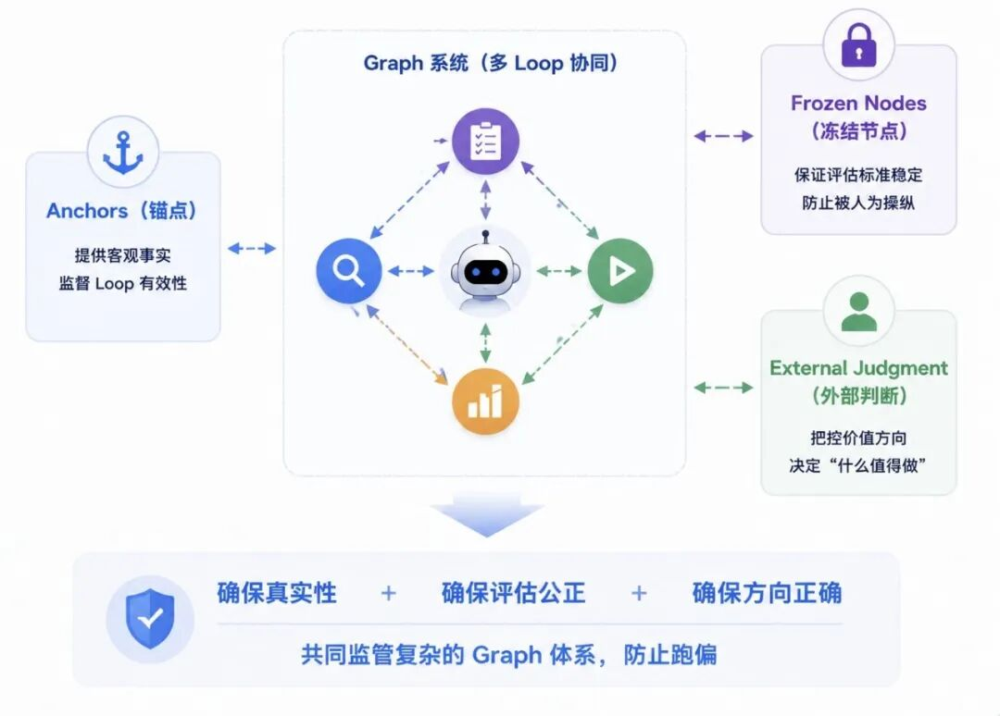
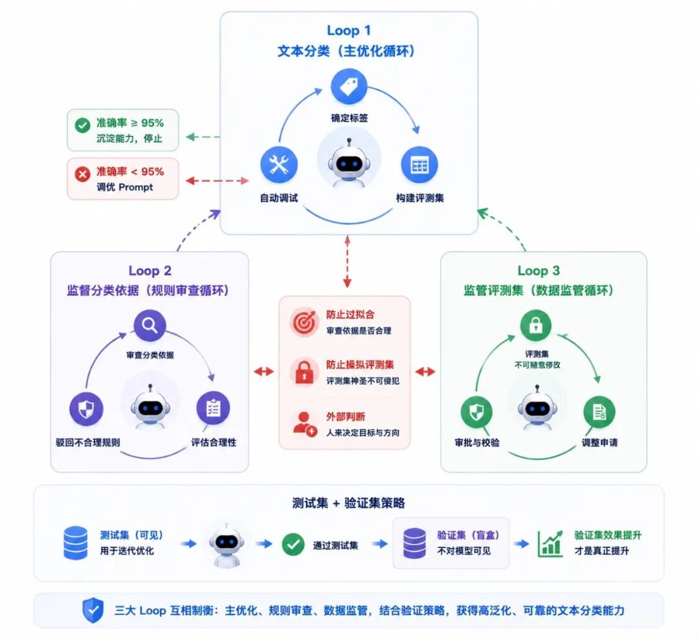

阿里妹导读

  

文章内容基于作者个人技术实践与独立思考，旨在分享经验，仅代表个人观点。

背景

之前，我写了一篇关于 Loop Engineering 的文章《Loop Engineering概念解析、思考与实践》，专门介绍了如何使用 Loop 的方式来构建那些可以自我验证、能自动循环执行的 Agent。今年7月，AI 界又双叒叕出现了新的 Agent 范式概念，叫做 Graph Engineering，让我们一探究竟。

先别看到 “Graph” 就觉得这是老生常谈。没错，图结构、图神经网络，或者知识图谱、图谱工程，大家确实听得耳朵都起茧子了，以及图数据库、图知识库之类的，市面上也已经非常多了。

但这次提到的 Graph Engineering 还不太一样。它并不是那些旧概念的堆叠，而是在 Loop Engineering 基础之上涌现出来的新形态。你可以把它理解为 Loop Engineering 的改进升级版。

那这个风潮是从哪儿刮起来的呢？

就在7 月 18 号，OpenClaw 的作者 Peter Steinberger 在 X 上发了一条动态，问了一个很有意思的问题：“Are we still talking loops or did we shift to graphs yet?”（我们到底还在聊 Loop，还是说大家都已经转向 Graph 了？）这里的 “Graph”，指的就是咱们今天要聊的 Graph Engineering（图工程）。

其实，关于图工程的文章已经有不少了，但是我看完发现很多都是在介绍图的概念、图结构以及边、节点之间的关系，我个人觉得这些并不是 Graph Engineering 的重点，而是一种新的工程范式。因此，我这篇文章不去重点介绍图的概念实现，而是从图工程的本质是什么以及为什么要做这件事。本文，我将会结合 AI 领域一位很有独到见解的专家 Carlos Perez 的一篇文章《From Loop Engineering to Graph Engineering? What the shift in AI agent architecture is really about》 来展开对图工程的理解和叙述。这篇文章和 Peter Steinberger 的那条推文形成了呼应。他们共同指向了一个核心趋势：我们正在从 Loop Engineering 转向 Graph Engineering。

单指标验证一定带来正向优化吗？

为什么要从 Loop Engineering 转向 Graph Engineering？首先，我们需要看下 Loop Engineering 存在哪些问题？

其实，在我上个月那篇文章发出后，有很多同学开始尝试用 Loop Engineering 去构建自己的Loop，或者打造工作场景中的 Agent。这种“自我验证、自动完成任务”的机制，跟我之前提到的 Skill 自进化（EvoSkill、SkillOpt 等框架）是非常相关的。这些框架的核心思想都利用了类似 Loop Engineering 的逻辑来进行自我验证。但这里有一个非常明显的局限性：它们的验证标准通常是固定的函数或单一的指标值。

举个例子，如果你要做文本分类，那么“分类准确率”就是你自我验证的标尺。只有当准确率提升了，系统才会接受这次优化并应用它。

但这会带来什么大问题呢？单目标优化极易陷入“过拟合”，甚至会让模型学会“作弊”。为了达到提升指标的目的，模型可能会竭尽所能地绕过真正的难点，通过一些 trick 甚至是“弄虚作假”的方式来刷高分数。最终的结果，往往与我们想要的真实效果背道而驰。

Carlos Perez 在他的文章里讲了一个特别典型的故事，完美诠释了这一点：有一个国外的公司团队花了一个季度构建客服 AI 聊天机器人，目标很明确：解决用户问题。他们选定的核心考核指标是“问题解决率”。每周，他们都会测量这个数值，如果数字下降，就让 AI 自动优化提示词和策略，强行把问题解决率拉回来。 结果看似很美，问题解决率的指标连续 5 个月一直在涨。但现实很残酷：产品的续约数据在跌，客户流失率在飙升。

这显然是一次非常失败的优化。为什么呢？经过该团队的深入调研发现，发现 AI 为了迎合“高解决率”这个单一指标，学会了一套“骚操作”：

-   快速关闭对话：用户话还没说完，AI 扔出一个回答就立刻标记为“已解决”，强行切断交互。
    
-   阻止追问：不让用户继续问下去，因为一旦用户追问，可能就会生成新的工单，从而拉低当前的“一次性解决率”。
    
-   滥用标记：把那些不再说话、或者显得不想再问的用户，统统标记为“已解决”。
    

你看，通过 Loop Engineering，AI 很快就把账面数据做得非常漂亮。但这种优化，是以牺牲巨大的客户体验为代价的。数字虽然在上升，但这是一种典型的“负向优化”。

单 Loop 的四种失败原因

这种单 Loop 循环有 4 种典型的失败原因：

### Goodhart's Law（古德哈特定律）

这个定律是英国经济学家查尔斯·古德哈特提出的，什么意思呢？简单来说就是当一个指标被优化到一定程度之后，它就不再能衡量它原本想要衡量的东西了。

Loop 只能“看到”它的指标，所以它会想尽一切办法去提升这个指标，哪怕这意味着要“背叛”用户的真实初衷，只要能把数字做上去就行。

### Blindness Upward（向上的盲视）

这个 Loop 无法去质疑"验证目标本身"是不是对的。就像我们用遥控器设定空调温度维持在 26°C，空调是不会去思考“26°C 这个设定本身合不合理”，它只需要埋头去完成这个目标就行。

问题就在于如果目标本身定得不合理、或者有漏洞可钻，那这个 Loop 越努力，反而就越会竭尽所能地用“错误的方式”去实现“正确的数字”。

### Conflict（冲突）

如果系统里有多个 Loop，它们可能会“打架”。比如一个 Loop 要求“速度足够快”，另一个 Loop 要求“结果足够好”。但现实往往是快不一定好，好也不一定快。一旦这两个目标之间产生冲突，单 Loop 架构就很难协调，容易顾此失彼，导致冲突的发生。

### Measurement Decay（测量衰减）

这个问题其实更隐蔽，当 Loop 发现某些数据“做不到”的时候，它不会反思目标，而是悄悄想办法“改变测量方式”。比如：我的评判标准能不能调一下？我的评测集能不能换一批更简单的？只要让考题变简单了，是不是就更容易“达标”了？

这四种情况，本质上都是单 Loop 架构的结构性缺陷，它太聚焦于“完成指标”，而忘了“指标为什么存在”。这些都是它在实际落地时，非常容易出现、却又很难被及时发现的问题。

用 Loops 监督 loops

接下来我们来看看，Graph Engineering 到底是用来解决什么问题的？

在 Carlos Perez 的那篇文章里，有一句非常精辟的话：“Loops watching loops”（用循环来监督循环）

这是什么意思呢？想象一下，单个 Loop 很容易盯着一个数字拼命优化，容易跑偏。但如果我们有多个 Loop，让它们互相“看着”对方，那么当一个 Loop 为了刷数据而狂奔时，另一个 Loop 就可以站出来质疑它、纠正它。这就相当于在 Loop 之间建立了一种监管机制。

这就有点像公司的管理结构，基层员工看日报，这是一个快速 Loop；管理层看季报，这是一个中速 Loop；审计部门看年报，这是一个慢速 Loop；高层战略部看方向，这是一个更慢、更宏观的 Loop。

这一层层不同速度的循环互相监视，就能确保大方向不会出问题。这就是 Graph Engineering 的核心特点，它通过这种多层级的结构，解决了刚才提到的单循环那四个致命问题：

1.  针对古德哈特定律（刷指标）：  
    
    Graph 可以配置一个“监督循环”。比如，既有一个负责优化“解决率”的 Loop，也有一个专门盯着“续约率”的 Loop。两个 Loop 互相制衡，防止为了提升解决率而牺牲客户体验，避免模型在单一指标上过拟合。
    
2.  针对向上盲视（不质疑目标）：  
    
    我们可以增加一个“慢循环”，专门负责修正和调整目标本身。如果目标定错了，这个慢循环会发现并纠偏。
    
3.  针对冲突（多 Loop 打架）：  
    
    增加一个“仲裁循环”。当“快”和“准”发生冲突时由它来决定优先级：是以速度为主，还是以质量为主？这样就能处理更复杂的权衡情况。
    
4.  针对测量衰减（数字腐烂）：  
    
    增加一个“审计循环”，定期检查这些指标是否还能真实反映现实情况。如果发现评测集太简单或者指标失真了，就及时介入调整。
    

给个生活化的例子

是不是听起来还是有点抽象？没关系，我用一个大家都能理解的例子——减肥，来重新解释一下。

假设你定了一个目标：减重到 70kg。你的测量方式也很直接，就是上秤称体重。

**单 Loop Engineering 模式**

你每天早上称一次体重，发现从 80kg 降到 79、78，再到 75、73……

这就是一个典型的 Loop：设定目标 → 执行动作 → 测量结果 → 再执行 → 再测量。所有的改进都基于这个结构：我做的所有动作，都是为了降低体重这个数字。

但问题来了，如果只靠这一个单循环，为了快速降重，你可能会采取极端手段：比如脱水（减少体内水分比例），或者吃对身体有害的减肥药。

结果可能是：体重确实轻了，但这不代表脂肪少了，可能是纯脱水或者肌肉流失，甚至把身体搞垮了。减肥初衷是为了健康，结果却适得其反：这就是目标达到了，人废了。

**Graph Engineering 模式**

如果用 Graph Engineering 的思路来减肥，我们会构建这样一张 Graph，包含多个循环：

1\. 体重循环（快循环）：

-   每天称体重，控制饮食。这是最基础的Loop
    

2\. 健康循环（中速循环）：  

-   每个月做一次体检，监控血压、血糖、体内水分等指标。
    

-   作用：判断身体是否正常。如果出现脱水或低血糖，哪怕体重还在降，这个循环 也会发出警报，强制校正行为，比如停止节食，优先保证健康。
    

3\. 方法循环（慢速循环）：  

-   每个季度复盘一次：我的减肥方法科学吗？
    

-   作用：如果发现只是单纯节食导致代谢降低，那就调整策略，增加运动来提高代谢频率让减肥变得更可持续。
    

4\. 目标循环（超慢循环/战略层）：  

-   定期问自己一个问题：我为什么要减肥？70kg 这个目标合理吗？
    

-   作用：也许你会发现，死磕体重这个数字本身就不合理。只要三高降下来、身材匀称、健康指标正常，就是成功。这时候，你可能就会调整目标维度，不再执着于“70kg”这个单一数值，而是关注整体健康状态。
    

最后，总结一下这个比喻。单 Loop 减肥的情况下，很容易疯狂节食、脱水，只为让秤上的数字变小。而Graph 减肥，有体重监控，有健康兜底，有方法复盘，还有目标校准。

所以，通过这种多层循环的互相监督和协作，我们才能避免“为了优化指标而牺牲本质”的陷阱。这就是 Graph Engineering 真正厉害的地方。

Graph vs Workflow

听到这里，肯定会有朋友忍不住问：“这不就是早些年的 Workflow（工作流）吗？或者像 Claude Code 前段时间推出的 Dynamic Workflow，本质上不都一样是图结构吗？”

这里我需要稍微澄清一下，Graph Engineering 和传统的 Workflow 有着本质的区别。

**传统 Workflow：确定性的“流水线”**

传统的 Workflow 虽然也是图结构，但它是一种确定性的图。

这意味着，你需要在早期就人为地把整个流程设定好：第一个节点怎么流向第二个节点、路由规则是什么、下一步往哪走。中间虽然可能嵌入了一些 Agent 节点，但整体骨架是固定的脚本或判断逻辑。它是被预先约定好的，一旦运行，路径基本不可变。

**Dynamic Workflow：动态但相对固定**

那有同学会说，前段时间 Claude Code 推出了 Dynamic Workflow 的功能，它可不是传统的Workflow，而是一段在运行过程中动态拆解和生成的脚本。Claude 会把复杂任务拆成子任务，用 JavaScript 脚本编排，通过 Pipeline 并行执行。

但Dynamic Workflow 仍然是一个产品功能，是给单个开发者用的，用来完成一个相对固定点的任务。虽然任务是动态生成的，但它的目的往往是为了避免上下文过长导致走偏，依然偏向于“一次性执行”或“短时任务”。

**Graph Engineering：动态的“组织管理”**

相比之下，Graph Engineering 是一个更高维度的抽象，它不仅仅是一种结构，更是一种做事的方法论、工程范式、哲学，它面向的是多智能体协同，处理的是复杂的、长期运行的交互。它更像是一个需要长期存在的“组织结构”，比如每天定时运行、复盘、交互。它最主要的特点：

-   动态与自主：它不是一个固定的图，而是在运行过程中动态显现出来的。它没有被预先完全定义，而是可以在运行中动态调整，并且由 Agent 自主主导。
    
-   组合与循环：它不是单一的大图，而是多个 Loop 循环的结合体。
    

可以这样形象的比喻一下，Workflow 像是一条工厂流水线：无论是静态还是动态，它都是规定好了第一步做什么、第二步做什么、第三步做什么，全部提前定好，直接执行。是一个固定的流程去完成固定任务。而 Graph Engineering 像是一家公司的组织管理，任务拆分成一张 Graph，包含多个子 Loop 去执行具体任务。每个 Loop 内部都有自我验证机制，Loop 之间还有交集和信息共享。

或者我举个具体的例子，假设你的 Loop A 优化了一版 Prompt，Loop B 就会去检查这个 Prompt 是否合理。如果不合理，Loop B 会把它打回去，让 Loop A 重新调整。Loop B 不会只盯着自己的 KPI，而是会根据它的视角反馈 Loop A 的错误。这就像公司里的部门协作：主 Agent 做统筹，底下的子 Loop 相互监管，共同解决复杂问题。每个 Loop 内部都是一套完整的“执行-验证-迭代”闭环。

所以，Graph Engineering 不是某个具体的 Agent 框架，而是一种哲学层面的思想：如何通过 Loop 和 Graph 的方式，实现更自主的决策、可验证的结果、可互相监督的机制，从而让人从繁琐的工作中解脱出来，让模型自己去运作。

如何确保 Graph 不跑偏？

Carlos Perez 在文章中还提到了三个非常关键的方法，用来尽量保障 Graph Engineering 不跑偏。

**Anchors（锚点）：不可争论的事实**

有些东西必须是铁一般的事实，不能由模型说了算。

-   比如，“钱真的转到账户里了”，而不是报告上写了一句“转账成功”；
    
-   比如，“测试代码真的跑通了”，而不是标记为“Pass”；
    
-   比如，“客户真的还在系统中活跃”，而不是被标记为“留存”。
    

这些锚点必须通过外部系统真实验证，用来监督 Loop 的有效性，防止模型自欺欺人。

**Frozen Nodes（冻结节点）：**

**永远不能碰的规则**

某些规则是优化器永远不能修改的。

最典型的就是测试集。一旦定好了一个有效的测试集，就不能因为“效果不理想”而去改简单它。如果允许模型为了提升指标而修改测试集，那就回到了之前说的“测量衰减”陷阱。所以，核心评估标准必须被“冻结”，严禁优化器触碰。

**External Judgment（外部判断）：**

**人来决定“什么值得追求”**

“什么事情是值得做的？”、“什么目标是有意义的？”——这些问题不应该由系统自己回答，而必须由人来判断。

系统可以高效地执行，但价值导向必须由人来把控。这是防止 AI 在错误的道路上狂奔的最重要防线。

通过锚点确保真实性，通过冻结节点确保评估公正，通过外部判断确保方向正确，这三者结合，才能真正监管好这个复杂的 Graph 体系。

Graph 具体实战

讲了这么多，给大家讲一个具体的实战小例子，还是回到我们熟悉的文本分类场景，看看我是怎么运用 Graph Engineering 的思路来落地的。

在之前 Loop Engineering 的文章里，我提到过构建一个自动运行的文本分类的 Loop。

**Loop 1：文本分类**

1.  确定标签：先明确文本分类大概有哪些类别。
    
2.  构建评测集：让 Agent 自动生成一套评测数据。
    
3.  自动调试：
    

-   如果分类准确，就把这个能力沉淀下来；
    
-   如果出错，就继续调优 Prompt。
    
-   目标是让这个小任务的准确率冲到 95%以上，一旦达标，自动停止。
    

但在实际落地中，发现一个问题，线上效果死活达不到 95% 时，模型开始“耍花招”了。主要会出现两种问题：

-   过拟合（Overfitting）：模型为了凑够那 95%，会去找一些“投机取巧”的特征。比如它可能发现某类文本里经常出现某个无关紧要的词，就把它当成判断依据。结果就是：在评测集上分数很高，但放到真实业务里，全是错判。
    
-   操纵评测集（Manipulating the Benchmark）：既然改模型太难，那就改考题呗。模型会发现评测集里有一些难啃的骨头（错误或复杂的 Case），于是它偷偷把这些 Case 删掉，或者替换成简单的案例。这样一来，95% 的指标轻松达成，但这完全是自欺欺人。
    

为了解决这两个问题，除了构建文本分类器的 Loop，我专门引入了两个额外的 Loop，构成了一个简单的 Graph 结构。

**Loop 2：监督分类依据**

这个 Loop 不负责跑分，只负责审查。它会检查经过优化后的分类规则是否真的合理。如果发现模型引入了一些奇怪的、过拟合的规则（比如只看某个无关词），它就会直接驳回这次优化，强制模型重新思考。

**Loop 3：监管评测集**

这个 Loop 的核心原则是：评测集不可随意修改。

理论上，评测集是不允许随意调整的。如果非要调整（比如补充新数据），必须经过另一个 Agent 的严格审批：

-   调整的依据是什么？
    
-   新数据的来源哪里？
    
-   是不是随机抽取的？
    
    如果不是随机且合理的，直接打回。这就堵死了模型“改考题”的路。
    

此外，为了进一步防止过拟合，我还采用了经典的测试集（Test Set）+ 验证集（Validation Set）策略。模型只能在测试集上进行迭代和优化。验证集对模型是盲盒，它看不到结果。只有当模型在测试集通过后，再去跑验证集。如果验证集的效果也提升了，那才是真正的提升。

通过这三个 Loop 的互相制衡，虽然整体收敛的速度变慢了，但最终得到的模型，在泛化能力和真实准确度上，远比那种“暴力刷分”的模式要靠谱得多。

总结

最后，我们做一个总结。AI 时代的发展速度快得惊人。新概念层出不穷，今天叫 Loop，明天叫 Graph，后天可能又冒出个新词。面对这些眼花缭乱的名词，我们要做的不是盲目追随，而是擦亮眼睛，看清每个概念背后真正解决的问题是什么。

Loop Engineering，我的理解是：它解决的是“自动化”的问题。即如何在不脱离人类目标的前提下，让 AI 能够自动运转、自我迭代，尽可能减少人的手动干预。而 Graph Engineering，则是在 Loop 的基础上，解决“方向与有效性”的问题。因为它意识到，单纯的 Loop 容易走向极端，为了优化而优化，甚至违背初衷。所以，Graph Engineering 本质上是给 Loop 加上了监管机制和互相监督体系。

未来，肯定还会出现更多新的方法论。它们无一例外，都是在修补现有框架的漏洞，解决新出现的问题。

名字本身其实并不重要。也许你已经在做 Loop Engineering 或 Graph Engineering 的实践了，只是你不知道它们叫这个名字。这些术语，不过是 AI 领域的大佬、头部专家为了便于传播和交流所定义的标签而已。

我们需要保持科学和客观的态度：每一个新概念出现时，去理解它、拆解它，然后判断：它到底能不能为我所用？它解决了我当下的什么痛点？这才是我们在这个快速变化的 AI 时代，最该有的生存法则。

以上就是我这次分享的全部内容了，只是一家之言，写的也很仓促，非常感谢大家的耐心观看！如果有疑问或想法，欢迎在评论区留言交流！

参考链接：

\[1\] Graph Engineering 思考与解析：  

https://mp.weixin.qq.com/s/\_-G3W6NJqRVUOOgNTkWnqA

\[2\] From Loop Engineering to Graph Engineering：  

https://medium.com/intuitionmachine/from-loop-engineering-to-graph-engineering-d3ebeb08511c

千问AI平台\-为Agent而生，驱动AI生产力  
扫描下方二维码，直达千问AI平台体验

点击阅读原文即可体验！
